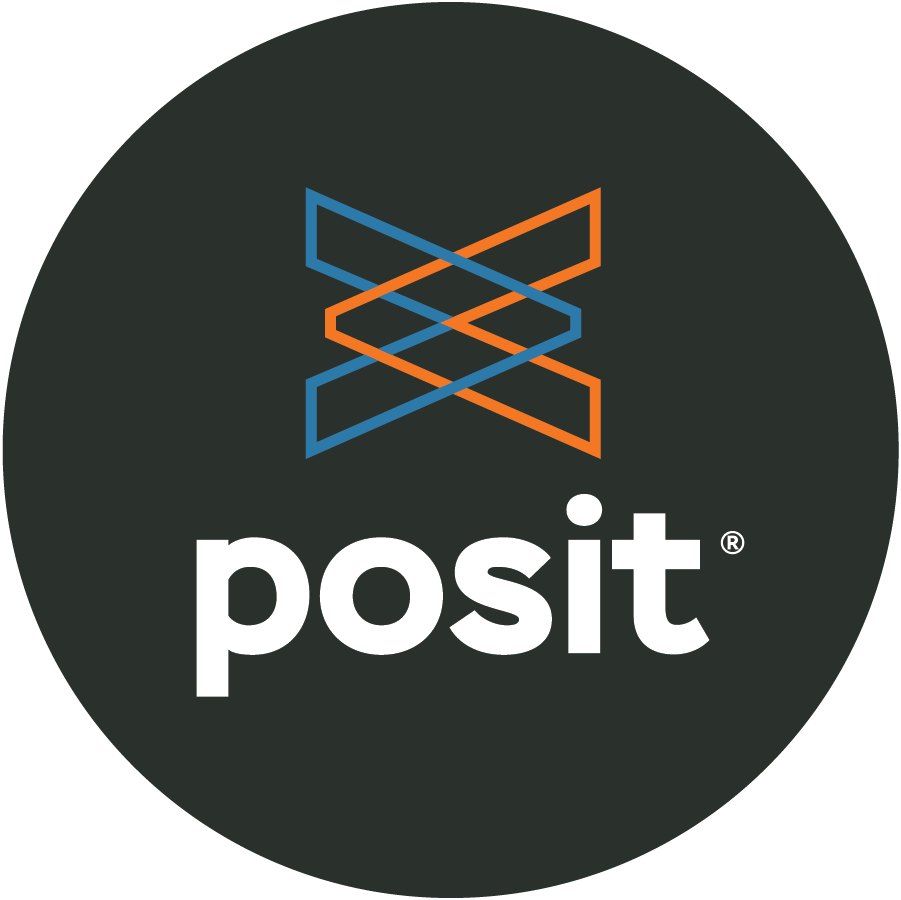

layout: true

<div class="my-footer">
  <span style="text-align:center">
    <span> 
      
    </span>
    <a href="https://therbootcamp.github.io/">
      <span style="padding-left:82px"> 
        <font color="#7E7E7E">
          www.therbootcamp.com
        </font>
      </span>
    </a>
    <a href="https://therbootcamp.github.io/">
      <font color="#7E7E7E">
       Dashboards mit Shiny | März 2023
      </font>
    </a>
    </span>
  </div> 

---


```{r setup, include=FALSE}
options(htmltools.dir.version = FALSE)
options(width=110)
options(digits = 4)

knitr::opts_chunk$set(fig.align = 'center')
```

.pull-left5[

# Gratulation!

<ul>
  <li class="m1"><span>Nach 3 intensiven Tagen kennt ihr nun die Grundlagen von Shiny!</span></li>
  <ul class="level">
    <li><span>Basics</span></li>
    <li><span>Reaktivität</span></li>
    <li><span>Layout</span></li>
    <li><span>Daten IO</span></li>
    <li><span>Interaktivität</span></li>
    <li><span>Graphiken</span></li>
    <li><span>Styling</span></li>
  </ul>
</ul>
]

.pull-right4[
<br><br>
<p align="center">
<br>
<font style="font-size:10px">from <a href="https://swag.rstudio.com/s/shop">https://swag.rstudio.com</a></font>
</p>
]

---

.pull-left3[

# Agenda

<ul>
  <li class="m1"><span><mono>bslib</mono></span></li>
  <li class="m1"><span><mono>shinyWidgets</mono></span></li>
  <li class="m2"><span>Modules</span></li>
  <li class="m3"><span>Datenbanken</span></li>
  <li class="m3"><span>Deployment</span></li>
  <li class="m4"><span>Resourcen</span></li>
</ul>
]

.pull-right6[
<br><br><br>
<p align = "center">
  <br>
  <font style="font-size:12px">from <a href="https://unsplash.com/photos/ETRPjvb0KM0">unsplash.com</></font>
</p>

]

---

.pull-left4[

#<mono>bslib</mono>


<ul>
  <li class="m1"><span><mono>bslib</mono> lieftert reichlich Funktion neben dem Theming</span></li>
  <ul class = "level">
    <li><span>Cards</span></li>
    <li><span>Value boxes</span></li>
    <li><span>Sidebars </span></li>
    <li><span>Layouts </span></li>
  </ul>
</ul>

]

.pull-right[
<br>
<iframe src="https://rstudio.github.io/bslib/articles/cards.html" height=520px  width = 600px></iframe><br><font style="font-size:12px"><a href="https://rstudio.github.io/bslib/articles/cards.html">rstudio.github.io/bslib</a></font>

]

---

.pull-left4[

#<mono>bslib</mono>


<ul>
  <li class="m1"><span><mono>bslib</mono> lieftert reichlich Funktion neben dem Theming</span></li>
  <ul class = "level">
    <li><span>Cards</span></li>
    <li><span>Value boxes</span></li>
    <li><span>Sidebars </span></li>
    <li><span>Layouts </span></li>
  </ul>
</ul>

]

.pull-right[
<br>
<iframe src="https://rstudio.github.io/bslib/articles/value-boxes.html" height=520px  width = 600px></iframe><br><font style="font-size:12px"><a href="https://rstudio.github.io/bslib/articles/cards.html">rstudio.github.io/bslib</a></font>

]

---

.pull-left4[

#<mono>bslib</mono>


<ul>
  <li class="m1"><span><mono>bslib</mono> lieftert reichlich Funktion neben dem Theming</span></li>
  <ul class = "level">
    <li><span>Cards</span></li>
    <li><span>Value boxes</span></li>
    <li><span>Sidebars </span></li>
    <li><span>Layouts </span></li>
  </ul>
</ul>

]

.pull-right5[
<br>
<iframe src="https://rstudio.github.io/bslib/articles/layouts.html" height=520px  width = 600px></iframe><br><font style="font-size:12px"><a href="https://rstudio.github.io/bslib/articles/cards.html">rstudio.github.io/bslib</a></font>

]


---

.pull-left3[

# <mono>shinyWidgets</mono>

<ul>
  <li class="m1"><span><mono>shinyWidgets</mono> liefert weitere UI Elementen mit <high>moderneren Designs</high> und dynamischen Inhalten</span></li>
</ul>
]

.pull-right5[
<br>
<iframe src="https://shinyapps.dreamrs.fr/shinyWidgets/" height=520px  width = 600px></iframe><br><font style="font-size:12px"><a href="https://shinyapps.dreamrs.fr/shinyWidgets/">shinyapps.dreamrs.fr</a></font>

]

---

.pull-left3[

# Module

<ul>
  <li class="m1"><span>Grössere Apps können von einer Modularen Struktur profitieren.</span></li>
  <li class="m2"><span>Sehr mächtig, aber weniger "what you see is what you get".</span></li>
</ul>
]

.pull-right5[
<br>
<iframe src="https://shiny.rstudio.com/articles/modules.html" height=520px  width = 600px></iframe><br><font style="font-size:12px"><a href="https://shiny.rstudio.com/articles/modules.html">shiny.rstudio.com</a></font>

]


---

.pull-left3[

# Datenbanken

<ul>
  <li class="m1"><span><mono>DBI</mono> und <mono>dbplyr</mono> liefern einfachen Zugriff auf verschiedene Datenbanken</span></li>
<li class="m2"><span>Dankebankzugriff in Shiny ist nich anders als in R</span></li>
</ul>
]

.pull-right5[
<br>
<iframe src="https://shiny.rstudio.com/articles/overview.html" height=520px  width = 600px></iframe><br><font style="font-size:12px"><a href="https://shiny.rstudio.com/articles/overview.html">shiny.rstudio.com</a></font>

]

---

.pull-left3[

# Markdown

<ul>
  <li class="m1"><span>Shiny Apps können auch HTML oder PDF Berichte über RMarkdown erstellen.</span></li>
<li class="m2"><span>Ein Markdown Bericht wird generiert über einen <mono>downloadHandler</mono></span></li>
</ul>
]

.pull-right5[
<br>
<iframe src="https://shiny.rstudio.com/articles/generating-reports.html" height=520px  width = 600px></iframe><br><font style="font-size:12px"><a href="https://shiny.rstudio.com/articles/generating-reports.html">shiny.rstudio.com</a></font>

]


---

.pull-left3[

# Deployment

<ul>
  <li class="m1"><span>Paket mit erweiterten UI Elementen</span></li>
</ul>
]

.pull-right5[
<br>
<iframe src="https://shiny.rstudio.com/deploy/" height=520px  width = 600px></iframe><br><font style="font-size:12px"><a href="https://shiny.rstudio.com/deploy/">shiny.rstudio.com</a></font>

]


---

# Resourcen

<br>
<table style="cellspacing:0; cellpadding:0; border:none; width:95%">
  <col width="24%">
  <col width="24%">
  <col width="24%">
  <col width="24%">
  <tr style="padding:20px;background-color:white">
    <td style="padding:20px;text-align:center">
      <a href="https://mastering-shiny.org/"><br><font style="font-size:12px">Mastering Shiny</font></a>
    </td>
    <td style="padding:20px;text-align:center">
      <a href="https://shiny.rstudio.com/articles/overview.html"><br><font style="font-size:12px">shiny.rstudio.com</font></a>
    </td>
    <td style="padding:20px;text-align:center">
      <a href="https://github.com/grabear/awesome-rshiny"><br><font style="font-size:12px">Awesome Shiny</font></a>
    </td>
    <td style="padding:20px;text-align:center">
      <a href="https://github.com/nanxstats/awesome-shiny-extensions"><br><font style="font-size:12px">Shiny Awesome</font></a>
    </td>
  </tr>
</table>

---

.pull-left45[
# Bitte gebt uns Feedback
<br><br>

<p align = "center">
  </img><br>
  <font style="font-size:10px">from <a href="https://cdn-images-1.medium.com/max/1600/1*5OZNYAfzDZfM1lwJBZEuHQ.png">medium.com</a></font>
</p>

]

.pull-right45[

<p align="center"><br><br>
<iframe src="https://docs.google.com/forms/d/e/1FAIpQLSdRBR9MbVCO2fp1_8Lnjw-J4EmQdEXUavlBWKVwqvGhR71bTw/viewform?embedded=true" width="430" height="550" frameborder="0" marginheight="0" marginwidth="0">Loading…</iframe></p>

]


---
class: center, middle

# Herzlichen Dank!
