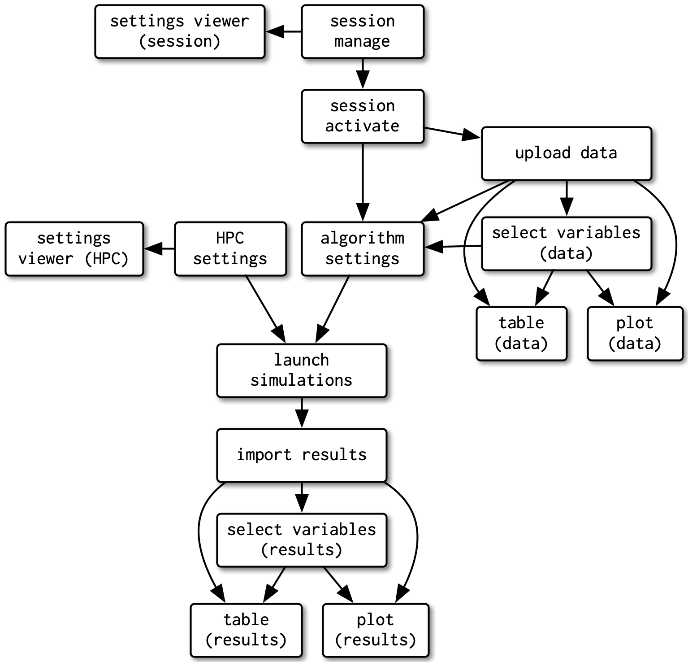

layout: true

<div class="my-footer">
  <span style="text-align:center">
    <span> 
      
    </span>
    <a href="https://therbootcamp.github.io/">
      <span style="padding-left:82px"> 
        <font color="#7E7E7E">
          www.therbootcamp.com
        </font>
      </span>
    </a>
    <a href="https://therbootcamp.github.io/">
      <font color="#7E7E7E">
       Dashboards mit Shiny | März 2023
      </font>
    </a>
    </span>
  </div> 

---


```{r setup, include=FALSE}
options(htmltools.dir.version = FALSE)
options(width=110)
options(digits = 4)

knitr::opts_chunk$set(fig.align = 'center')
```

.pull-left5[

# Gratulation!

<ul>
  <li class="m1"><span>Nach 3 intensiven Tagen kennt ihr nun die Grundlagen von Shiny!</span></li>
  <ul class="level">
    <li><span>Basics</span></li>
    <li><span>Reaktivität</span></li>
    <li><span>Layout</span></li>
    <li><span>Daten IO</span></li>
    <li><span>Interaktivität</span></li>
    <li><span>Graphiken</span></li>
    <li><span>Styling</span></li>
  </ul>
</ul>
]

.pull-right4[
<br><br>
<p align="center">
<br>
<font style="font-size:10px">from <a href="https://swag.rstudio.com/s/shop">https://swag.rstudio.com</a></font>
</p>
]

---

.pull-left3[

# Agenda

<ul>
  <li class="m1"><span>Erweitertes theming</span></li>
  <li class="m2"><span>Zusätzliche UI Elemente</span></li>
  <li class="m3"><span>Datenverbindungen</span></li>
  <li class="m4"><span>Modularität</span></li>
  <li class="m5"><span>Deployment</span></li>
  <li class="m6"><span>Packages und Erweiterungen</span></li>
</ul>
]

.pull-right6[
<br><br><br>
<p align = "center">
  <br>
  <font style="font-size:12px">from <a href="https://unsplash.com/photos/ETRPjvb0KM0">unsplash.com</></font>
</p>

]


---

.pull-left100[
<p align="center">
<br>
<font style="font-size:10px">from <a href="https://rstudio.github.io/bslib/articles/bslib.html">rstudio.github.io</a></font>
</p>
]

---

# Google Fonts mit <mono>bslib</mono>

.pull-left4[
<ul>
  <li class="m1"><span>Lässt Benutzer z.B. Google Fonts verwenden</span></li>
    <ul class="level">
    <li><span><a href="https://fonts.google.com">https://fonts.google.com</a></span></li>
  </ul>
</ul>
]

.pull-right5[
<p align="center">
<br>
<font style="font-size:10px">from <a href="https://fonts.google.com">https://fonts.google.com</a></font>
</p>
]

---

.pull-left35[

# Cards mit <mono>bslib</mono>

<ul>
  <li class="m1"><span>Cards können beliebig befüllt werden</span></li>
</ul>
]

.pull-right6[
<p align="center">
<br>
<font style="font-size:10px">from <a href="https://rstudio.github.io/bslib/articles/cards.html">https://rstudio.github.io</a></font>
</p>
]


---

.pull-left35[

# Cards mit <mono>bslib</mono>

<ul>
  <li class="m1"><span>Cards können beliebig befüllt werden</span></li>
  <li class="m2"><span>Inhalte können zur besseren Ansicht vergrössert werden</span></li>
</ul>
]

.pull-right6[
<p align="center">
<br>
<font style="font-size:10px">from <a href="https://rstudio.github.io/bslib/articles/cards.html">https://rstudio.github.io</a></font>
</p>
]

---

.pull-left35[

# Cards mit <mono>bslib</mono>

<ul>
  <li class="m1"><span>Cards können beliebig befüllt werden</span></li>
  <li class="m2"><span>Inhalte können zur besseren Ansicht vergrössert werden</span></li>
</ul>
]

.pull-right6[
<p align="center">
<br>
<font style="font-size:10px">from <a href="https://rstudio.github.io/bslib/articles/cards.html">https://rstudio.github.io</a></font>
</p>
]


---

# Valueboxes mit <mono>bslib</mono>

.pull-left4[
<ul>
  <li class="m1"><span>Valueboxes liefern wichtige Kennzahlen auf einen Blick</span></li>
</ul>
]

.pull-right5[
<p align="center">
<br>
<font style="font-size:10px">from <a href="https://rstudio.github.io/bslib/articles/value-boxes.html">https://rstudio.github.io</a></font>
</p>
]

---

.pull-left3[

# <mono>shinyWidgets</mono>

<ul>
  <li class="m1"><span>Paket mit erweiterten UI Elementen</span></li>
</ul>
]

.pull-right55[
<br>
<p align="center">
<br>
<font style="font-size:10px">from <a href="https://github.com/dreamRs/shinyWidgets">https://github.com</a></font>
</p>
]


---

# Datenquellen

.pull-left4[
<ul>
  <li class="m1"><span>In unseren Übungen haben wir mit statischen Daten gearbeitet.</span></li>
  <li class="m2"><span>R, und damit auch Shiny, bietet Interfaces zu vielen gängigen Datenbanken</span></li>
</ul>
]

.pull-right5[
<p align="center">
<br>
<font style="font-size:10px">from <a href="https://www.mysql.com/">https://www.mysql.com/</a></font>
</p>
]

---

.pull-left4[

# Modularität & Funktionen

<ul>
  <li class="m1"><span>Sobald Apps komplexer werden, wird's schnell unübersichtlich. </span></li>
</ul>
]

.pull-right5[
<br>
<p align="center">
<br>
<font style="font-size:10px">from <a href="https://mastering-shiny.org/scaling-modules.html">https://mastering-shiny.org</a></font>
</p>
]

---

.pull-left4[

# Modularität & Funktionen

<ul>
  <li class="m1"><span>Sobald Apps komplexer werden, wird's schnell unübersichtlich. </span></li>
  <li class="m2"><span>Shiny Modules helfen, die App in kleinere, unabhängige Module zu unterteilen.</span></li>
  <li class="m3"><span>Besonders für die parallele Zusammenarbeit von mehreren Entwickler:innen sinnvoll.</span></li>
  <li class="m4"><span>Zudem reduziert das Auslagern von wiederholtem Code in Funktionen Redundanz und Fehleranfälligkeit</span></li>
</ul>
]

.pull-right5[
<br>
<p align="center">
<br>
<font style="font-size:10px">from <a href="https://mastering-shiny.org/scaling-modules.html">https://mastering-shiny.org</a></font>
</p>
]

---

.pull-left4[

# Deployment

<ul>
  <li class="m1"><span>In unserem Kurs haben wir alle Apps lokal auf dem eigenen Computer laufen lassen</span></li>
  <li class="m2"><span>Der Sinn von Shiny ist natürlich, die App mehreren Usern übers Internet zur Verfügung zu stellen</span></li>
  <li class="m3"><span>Es verschiedene Wege, um deine App zu deployen, die unterschiedlich komplex und kostspielig sind</span></li>

</ul>
]

.pull-right5[
<br>
<p align="center">
<br>
<font style="font-size:10px">from <a href="https://www.unsplash.com">https://www.unsplash.com</a></font>
</p>
]


---

.pull-left4[

# Deployment Optionen

<ul>
  <li class="m1"><span><a href="https://shinyapps.io">shinyapps.io</a> </span></li>
  <ul class="level">
    <li><span>einfacher (und kostenloser) Einstieg für kleine Projekte und Testing ohne Server-Kenntnisse</span></li>
  </ul>
  <li class="m2"><span><a href="https://posit.co/products/open-source/shinyserver/">Shiny Server </a> (Open Source Edition)</span></li>
  <ul class="level">
    <li><span>Shiny Server von der eigenen IT gehostet</span></li>
  </ul>
  <li class="m3"><span><a href="https://posit.co/products/enterprise/connect/">Posit Connect</a></span></li>
  <ul class="level">
    <li><span>Umfangreiches Angebot von Posit für Unternehmen mit sehr umfangreichen Funktionen</span></li>
  </ul>
  <li class="m4"><span>weitere Optionen</span></li>
</ul>
]

.pull-right5[
<br><br>
<p align="center">
<br>
<font style="font-size:10px">from <a href="https://posit.co/products/open-source/shinyserver/">https://posit.co</a></font>
</p>
]

---

.pull-left5[

# Shiny Extensions

<ul>
  <li class="m1"><span>Es gibt unzählige Pakete, die Shiny erweitern</span></li>
  <li class="m2"><span><a href="https://github.com/nanxstats/awesome-shiny-extensions">Shiny Awesome</a> ist eine aktuell gehaltene Liste von Shiny Erweiterungen, sortiert nach Themen</span></li>
  <ul class="level">
    <li><span>Nicht alle Pakete sind aktiv entwickelt</span></li>
    <li><span>Es gibt viele spannende Projekte zu entdecken</span></li>
  </ul>
</ul>
]

.pull-right4[
<br>
<p align="center">
<br>
<font style="font-size:10px">from <a href="https://github.com/nanxstats/awesome-shiny-extensions">https://github.com</a></font>
</p>
]

---

.pull-left5[

# Shiny Ressources

<ul>
  <li class="m1"><span>Genauso, gibt es unzählige Ressourcen zu Shiny</span></li>
  <li class="m2"><span><a href="https://github.com/grabear/awesome-rshiny">Awesome Shiny</a> ist eine aktuell gehaltene Liste von Shiny Ressourcen</span></li>
  <ul class="level">
    <li><span>Tutorials</span></li>
    <li><span>Bücher</span></li>
    <li><span>Websites</span></li>
    <li><span>Personen</span></li>
    <li><span>...</span></li>
  </ul>
</ul>
]

.pull-right4[
<br>
<p align="center">
<br>
<font style="font-size:10px">from <a href="https://github.com/grabear/awesome-rshiny">https://github.com</a></font>
</p>
]


---
class: middle, center

<h1><a href=https://therbootcamp.github.io/Shiny_2023CSS/index.html>Agenda</a></h1>
