layout: true

<div class="my-footer">
  <span style="text-align:center">
    <span> 
      
    </span>
    <a href="https://therbootcamp.github.io/">
      <span style="padding-left:82px"> 
        <font color="#7E7E7E">
          www.therbootcamp.com
        </font>
      </span>
    </a>
    <a href="https://therbootcamp.github.io/">
      <font color="#7E7E7E">
       Dashboards mit Shiny | März 2023
      </font>
    </a>
    </span>
  </div> 

---

```{r setup, include=FALSE}
options(htmltools.dir.version = FALSE)

#options(width=110)
#options(digits = 4)
```

```{r, echo = FALSE ,message = FALSE, warning = FALSE}
knitr::opts_chunk$set(comment=NA, 
                      echo = TRUE, eval = TRUE, 
                      message = FALSE, warning = FALSE, 
                      fig.align = 'center', dpi = 200)
library(tidyverse)
```


.pull-left3[

# Agenda


<ul>
  <li class="m1"><span>Erste App</span></li>
  <li class="m2"><span>UI und Server</span></li>
  <li class="m3"><span>UI Inputs</span></li>
  <li class="m3"><span>UI Outputs</span></li>
  <li class="m4"><span>Workflow</span></li>
</ul>

<br>


]

.pull-right6[
<br><br><br>
<p align = "center">
  <br>
  <font style="font-size:12px">from <a href="https://unsplash.com/photos/ETRPjvb0KM0">unsplash.com</></font>
</p>

]
---

# Erste App

.pull-left35[

<ul>
  <li class="m1"><span>Shiny Apps haben drei Komponenten</span></li><br>
  <ul class = "level">
    <li><span>ui - Frontend</span></li>
    <li><span>server - Backend</span></li>
    <li><span>shinyApp - Starter</span></li>
  </ul>
</ul>

]

.pull-right55[

<p align = "center">
  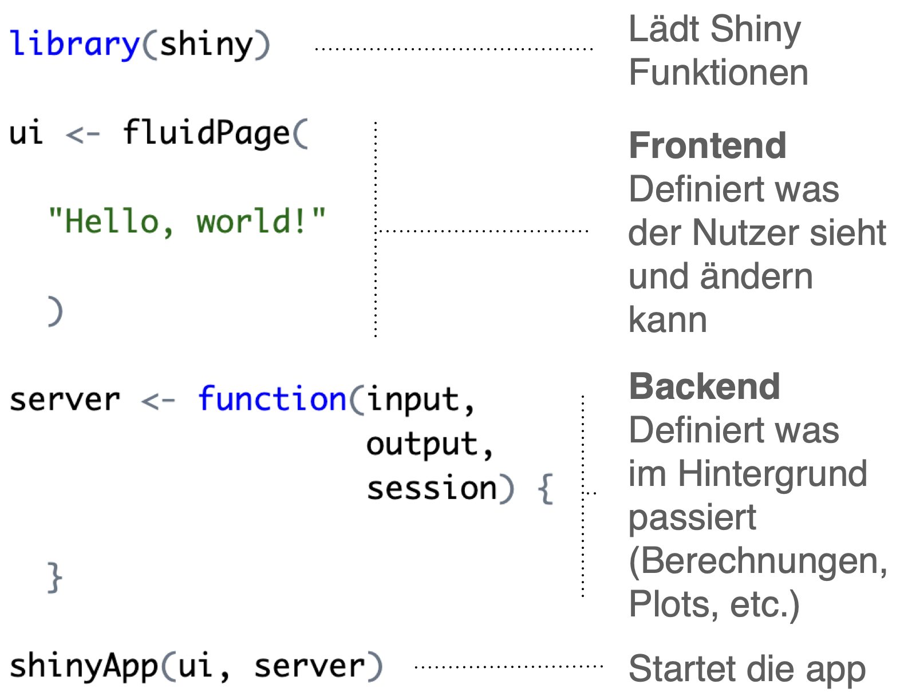
</p>

]


---

# UI

.pull-left3[

<ul>
  <li class="m1"><span>Das <high>User Interface</high> (UI) ist das Frontend</span></li><br>
  <li class="m2"><span>Wichtige Komponenten</span></li>
  <ul class = "level">
    <li><span>Layout</span></li>
    <li><span>Nutzerinputs</span></li>
    <li><span>Sichtbare Outputs</span></li>
  </ul>
</ul>

]

.pull-right6[

<p align = "center">
  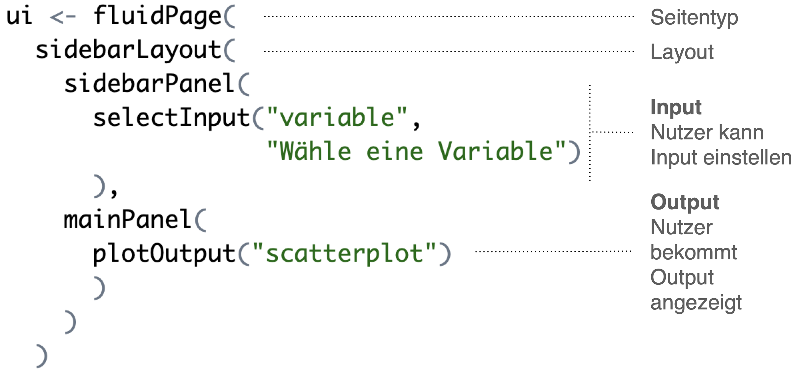
</p>

]

---

# Server

.pull-left3[

<ul>
  <li class="m1"><span>Der Server ist das Backend. Hier läuft der Code. </span></li><br>
  <li class="m2"><span>Wichtige Komponenten</span></li>
  <ul class = "level">
    <li><span>Datenaufbereitung</span></li>
    <li><span>Rendering von Plots oder Tabellen</span></li>
    <li><span>Reaktive Elemente</span></li>
  </ul>
</ul>

]

.pull-right65[

<p align = "center">
  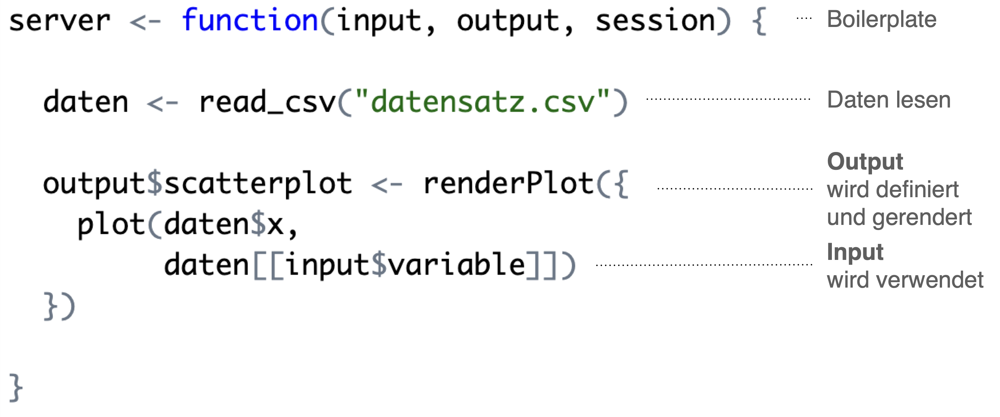
</p>

]


---

.pull-left3[

# Prozess

<ul>
  <li class="m1"><span>Shiny Apps</span></li><br>
  <ul class = "level">
    <li><span>ui - Frontend</span></li><br>
    <li><span>server - Backend</span></li><br>
    <li><span>shinyApp - Starter</span></li><br>
  </ul>
</ul>

]


.pull-right6[
<br><br>
<p align = "center">
  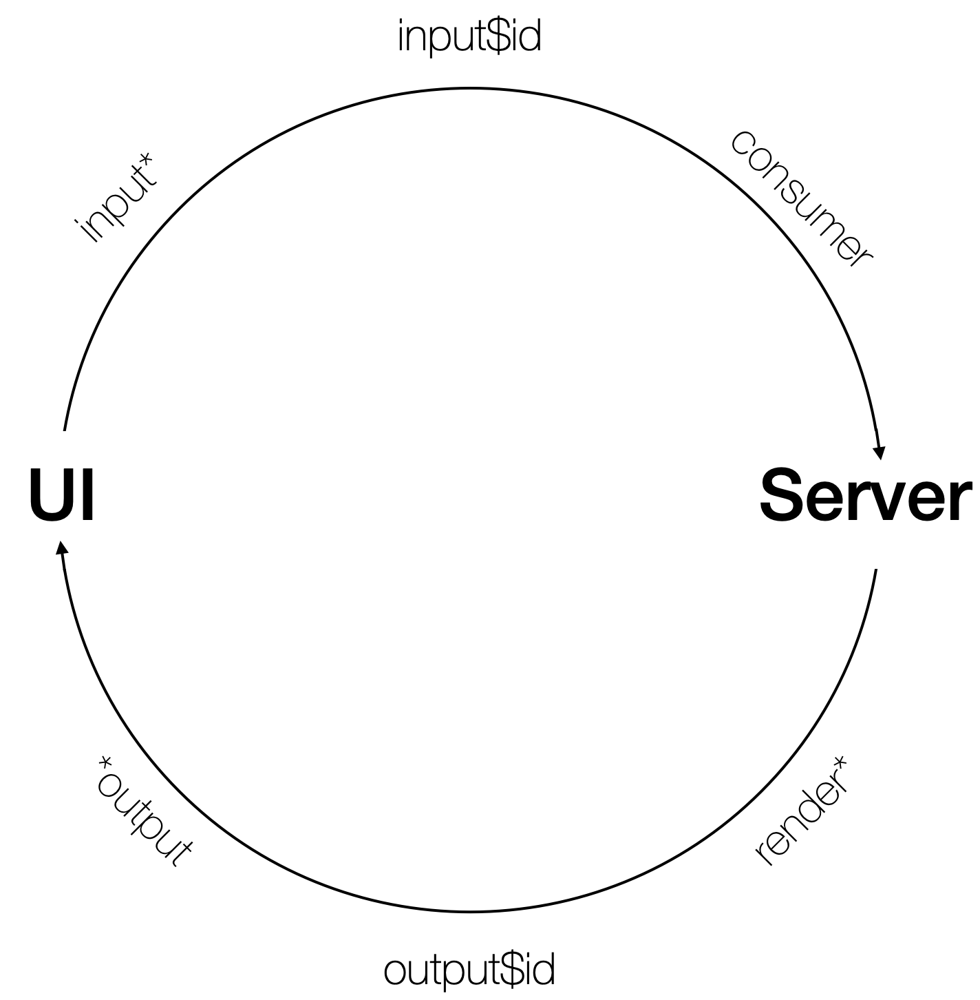
</p>

]

---

.pull-left4[

# Prozess

<ul>
  <li class="m1"><span>Shiny Apps haben drei Komponenten</span></li><br>
  <ul class = "level">
    <li><span>ui - Frontend</span></li><br>
    <li><span>server - Backend</span></li><br>
    <li><span>shinyApp - Starter</span></li><br>
  </ul>
</ul>

]


.pull-right5[
<br>
```{r, eval = FALSE, echo = TRUE}

library(shiny)

ui <- fluidPage(
  sidebarLayout(
    sidebarPanel(
      selectInput("variable", 
                  "Wähle eine Variable")
      ),
    mainPanel(
      plotOutput("scatterplot")
      )
    )
  )

server <- function(input, output, session) {
  
  daten <- read_csv("datensatz.csv")
  
  output$scatterplot <- renderPlot({
    plot(daten$x, 
         daten[[input$variable]])
  })
  
}

shinyApp(ui, server)


```
]


---

# UIs


.pull-left4[

<ul>
  <li class="m1"><span>Viele verschiedene Inputs sind verfügbar</span></li><br>
  <li class="m2"><span>Zentrale Argumente</span></li>
  <ul class = "level">
    <li><span><highm>inputId</highm></span></li>
    <li><span><mono>label</mono></span></li>
  </ul>
</ul>

]


.pull-right5[

<table style="cellspacing:0; cellpadding:0; border:none; width:70%">
<col width="20%">
  <col width="60%">
  <tr style="padding:20px;background-color:white">
    <td style="padding:20px;text-align:center"></mono>character</mono> (free)</td>
    <td><mono>textInput(), textAreaInput()</mono></td>
  </tr>
  <tr style="padding:20px;background-color:white">
    <td style="padding:20px;text-align:center"><mono>character</mono> (preset)</td>
    <td><mono>selectInput() radioButtons(), checkboxInput(), checkboxGroupInput()</mono></td>
  </tr> 
  <tr style="padding:20px;background-color:white">
    <td style="padding:20px;text-align:center"><mono>numeric</mono></td>
    <td><mono>numericInput() sliderInput()</mono></td>
  </tr>
  <tr style="padding:20px;background-color:white">
    <td style="padding:20px;text-align:center"><mono>date</mono></td>
    <td><mono>dateInput() dateRangeInput()</mono></td>
  </tr>
  <tr style="padding:20px;background-color:white">
    <td style="padding:20px;text-align:center">special</td>
    <td><mono>fileInput(), downloadButton(), actionButton()</mono></td>
  </tr>
</table>
]

---

# `textInput`


.pull-left35[

<ul>
  <li class="m1"><span>Viele verschiedene Inputs sind verfügbar</span></li><br>
  <li class="m2"><span>Zentrale Argumente</span></li>
  <ul class = "level">
    <li><span><highm>inputId</highm></span></li>
    <li><span><mono>label</mono></span></li>
  </ul>
  <li class="m2"><span>Weitere Argumente</span></li>
  <ul class = "level">
    <li><span><mono>value</mono></span></li>
    <li><span><mono>width</mono></span></li>
    <li><span><mono>placeholder</mono></span></li>
  </ul>
</ul>

]

.pull-right5[

```{r, eval = FALSE}
ui <- fluidPage(
  textInput(inputId = "name", 
            label = "Wie lautet dein Name?")
  )
```

<p align = "left">
  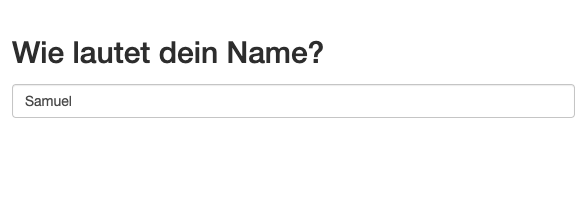
</p>

]

---

# `textAreaInput`


.pull-left4[

<ul>
  <li class="m1"><span>Viele verschiedene Inputs sind verfügbar</span></li><br>
  <li class="m2"><span>Zentrale Argumente</span></li>
  <ul class = "level">
    <li><span><highm>inputId</highm></span></li>
    <li><span><mono>label</mono></span></li>
  </ul>
  <li class="m2"><span>Weitere Argumente</span></li>
  <ul class = "level">
    <li><span><mono>value</mono></span></li>
    <li><span><mono>width</mono></span></li>
    <li><span><mono>height</mono></span></li>
    <li><span><mono>placeholder</mono></span></li>
  </ul>
</ul>

]

.pull-right5[

```{r, eval = FALSE}
ui <- fluidPage(
  textAreaInput(inputId = "feedback", 
                label = "Hast du Feedback?")
  )
```

<p align = "left">
  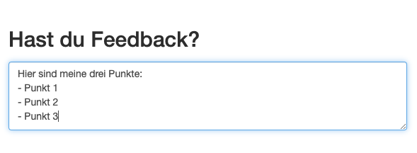
</p>

]

---

.pull-left4[

# `selectInput`

<ul>
  <li class="m1"><span>Viele verschiedene Inputs sind verfügbar</span></li><br>
  <li class="m2"><span>Zentrale Argumente</span></li>
  <ul class = "level">
    <li><span><highm>inputId</highm></span></li>
    <li><span><mono>label</mono></span></li>
  </ul>
  <li class="m2"><span>Weitere Argumente</span></li>
  <ul class = "level">
    <li><span><mono>choices</mono></span></li>
    <li><span><mono>selected</mono></span></li>
    <li><span><mono>multiple</mono></span></li>
    <li><span><mono>width</mono></span></li>
  </ul>
</ul>

]

.pull-right5[
<br><br>
```{r, eval = FALSE}
ui <- fluidPage(
  selectInput(inputId = "wohnort", 
              label = "Wo wohnst du?",
              choices = c("Luzern", ...)),
  textAreaInput(inputId = "wohnort", 
                label = "Wo wohnst du?",
                choices = c("Luzern", ...),
                multiple = TRUE)
  )
```

<p align = "left">
  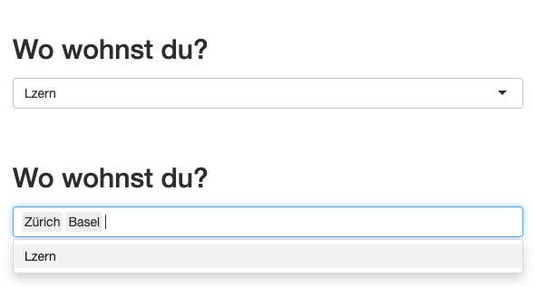
</p>

]


---

# `radioButtons`

.pull-left4[

<ul>
  <li class="m1"><span>Viele verschiedene Inputs sind verfügbar</span></li><br>
  <li class="m2"><span>Zentrale Argumente</span></li>
  <ul class = "level">
    <li><span><highm>inputId</highm></span></li>
    <li><span><mono>label</mono></span></li>
  </ul>
  <li class="m2"><span>Weitere Argumente</span></li>
  <ul class = "level">
    <li><span><mono>choices</mono></span></li>
    <li><span><mono>selected</mono></span></li>
    <li><span><mono>inline</mono></span></li>
    <li><span><mono>width</mono></span></li>
  </ul>
</ul>

]

.pull-right5[

```{r, eval = FALSE}
ui <- fluidPage(
  radioButtons(inputId = "wohnort", 
               label = "Wo wohnst du?",
               choices = c("Luzern", ...))
  )
```

<p align = "left">
  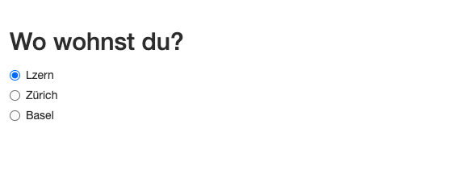
</p>

]

---

# `checkboxGroupInput`

.pull-left4[

<ul>
  <li class="m1"><span>Viele verschiedene Inputs sind verfügbar</span></li><br>
  <li class="m2"><span>Zentrale Argumente</span></li>
  <ul class = "level">
    <li><span><highm>inputId</highm></span></li>
    <li><span><mono>label</mono></span></li>
  </ul>
  <li class="m2"><span>Weitere Argumente</span></li>
  <ul class = "level">
    <li><span><mono>choices</mono></span></li>
    <li><span><mono>selected</mono></span></li>
    <li><span><mono>inline</mono></span></li>
    <li><span><mono>width</mono></span></li>
  </ul>
</ul>

]

.pull-right5[

```{r, eval = FALSE}
ui <- fluidPage(
  checkboxGroupInput(inputId = "wohnort", 
                     label = "Wo wohnst du?",
                     choices = c("Luzern", ...))
  )
```

<p align = "left">
  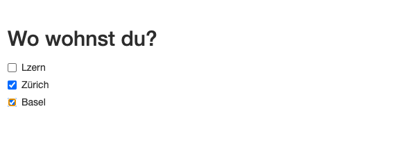
</p>

]

---

# `numericInput`

.pull-left4[

<ul>
  <li class="m1"><span>Viele verschiedene Inputs sind verfügbar</span></li><br>
  <li class="m2"><span>Zentrale Argumente</span></li>
  <ul class = "level">
    <li><span><highm>inputId</highm></span></li>
    <li><span><mono>label</mono></span></li>
  </ul>
  <li class="m2"><span>Weitere Argumente</span></li>
  <ul class = "level">
    <li><span><mono>value</mono></span></li>
    <li><span><mono>min</mono></span></li>
    <li><span><mono>max</mono></span></li>
    <li><span><mono>step</mono></span></li>
    <li><span><mono>width</mono></span></li>
  </ul>
</ul>

]

.pull-right5[

```{r, eval = FALSE}
ui <- fluidPage(
  numericInput(inputId = "grösse", 
               label = "Wie gross bist du?")
  )
```

<p align = "left">
  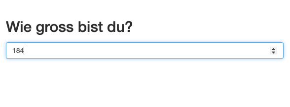
</p>

]

---

.pull-left4[

# `sliderInput`

<ul>
  <li class="m1"><span>Viele verschiedene Inputs sind verfügbar</span></li><br>
  <li class="m2"><span>Zentrale Argumente</span></li>
  <ul class = "level">
    <li><span><highm>inputId</highm></span></li>
    <li><span><mono>label</mono></span></li>
  </ul>
  <li class="m2"><span>Weitere Argumente</span></li>
  <ul class = "level">
    <li><span><mono>value</mono></span></li>
    <li><span><mono>min</mono></span></li>
    <li><span><mono>max</mono></span></li>
    <li><span><mono>step</mono></span></li>
    <li><span><mono>width</mono></span></li>
  </ul>
</ul>

]

.pull-right5[
<br><br>
```{r, eval = FALSE}
ui <- fluidPage(
  sliderInput(inputId = "grösse", 
              label = "Wie gross bist du?",
              min = 0, max = 300, 
              value = 100),
  sliderInput(inputId = "grösse", 
              label = "Wie gross bist du ca?",
              min = 0, max = 300, 
              value = c(100, 200)),
  )
```

<p align = "left">
  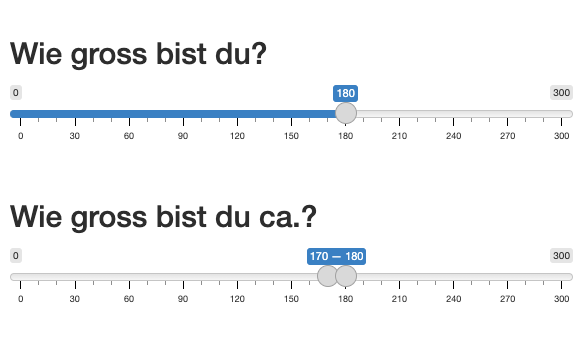
</p>

]

---

# `dateInput`

.pull-left4[

<ul>
  <li class="m1"><span>Viele verschiedene Inputs sind verfügbar</span></li><br>
  <li class="m2"><span>Zentrale Argumente</span></li>
  <ul class = "level">
    <li><span><highm>inputId</highm></span></li>
    <li><span><mono>label</mono></span></li>
  </ul>
  <li class="m2"><span>Weitere Argumente</span></li>
  <ul class = "level">
    <li><span><mono>value</mono></span></li>
    <li><span><mono>min</mono></span></li>
    <li><span><mono>max</mono></span></li>
    <li><span><mono>format</mono></span></li>
    <li><span><mono>startview</mono></span></li>
    <li><span><mono>language</mono></span></li>
    <li><span><mono>width</mono></span></li>
  </ul>
</ul>

]

.pull-right5[

```{r, eval = FALSE}
ui <- fluidPage(
  dateInput(inputId = "geburtstag", 
              label = "Geburtstag?")
  )
```

<p align = "left">
  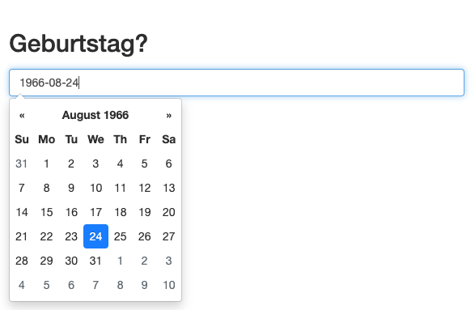
</p>

]

---

# `dateRangeInput`

.pull-left4[

<ul>
  <li class="m1"><span>Viele verschiedene Inputs sind verfügbar</span></li><br>
  <li class="m2"><span>Zentrale Argumente</span></li>
  <ul class = "level">
    <li><span><highm>inputId</highm></span></li>
    <li><span><mono>label</mono></span></li>
  </ul>
  <li class="m2"><span>Weitere Argumente</span></li>
  <ul class = "level">
    <li><span><mono>start</mono></span></li>
    <li><span><mono>end</mono></span></li>
    <li><span><mono>min</mono></span></li>
    <li><span><mono>max</mono></span></li>
    <li><span><mono>format</mono></span></li>
    <li><span><mono>startview</mono></span></li>
    <li><span><mono>language</mono></span></li>
    <li><span><mono>width</mono></span></li>
  </ul>
</ul>

]

.pull-right5[

```{r, eval = FALSE}
ui <- fluidPage(
  dateInput(inputId = "geburtstag", 
              label = "Geburtstag circa?")
  )
```

<p align = "left">
  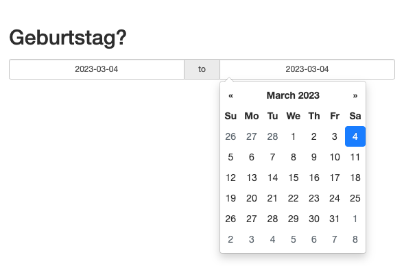
</p>

]

---

# `fileInput`

.pull-left4[

<ul>
  <li class="m1"><span>Viele verschiedene Inputs sind verfügbar</span></li><br>
  <li class="m2"><span>Zentrale Argumente</span></li>
  <ul class = "level">
    <li><span><highm>inputId</highm></span></li>
    <li><span><mono>label</mono></span></li>
  </ul>
  <li class="m2"><span>Weitere Argumente</span></li>
  <ul class = "level">
    <li><span><mono>buttonLabel</mono></span></li>
    <li><span><mono>placeholder</mono></span></li>
    <li><span><mono>accept</mono></span></li>
    <li><span><mono>width</mono></span></li>
  </ul>
</ul>

]

.pull-right5[

```{r, eval = FALSE}
ui <- fluidPage(
  fileInput(inputId = "geburtstag", 
            label = "Daten-Upload"
            buttonLabel = "Suche..", 
            placeholder = "Wähle Datei aus.")
  )
```

<p align = "left">
  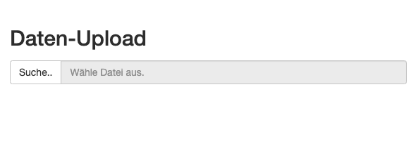
</p>

]

---

# `downloadButton`

.pull-left4[

<ul>
  <li class="m1"><span>Viele verschiedene Inputs sind verfügbar</span></li><br>
  <li class="m2"><span>Zentrale Argumente</span></li>
  <ul class = "level">
    <li><span><highm>inputId</highm></span></li>
    <li><span><mono>label</mono></span></li>
  </ul>
  <li class="m2"><span>Weitere Argumente</span></li>
  <ul class = "level">
    <li><span><mono>icon</mono></span></li>
  </ul>
</ul>

]

.pull-right5[

```{r, eval = FALSE}
ui <- fluidPage(
  actionButton(inputId = "download", 
               label = "Download")
  )
```

<p align = "left">
  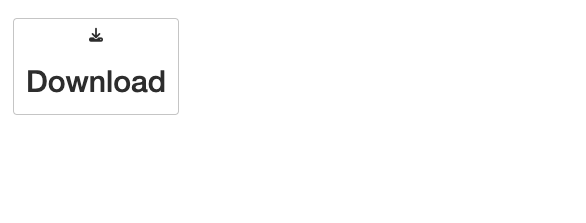
</p>

]


---

# `actionButton`

.pull-left4[

<ul>
  <li class="m1"><span>Viele verschiedene Inputs sind verfügbar</span></li><br>
  <li class="m2"><span>Zentrale Argumente</span></li>
  <ul class = "level">
    <li><span><highm>inputId</highm></span></li>
    <li><span><mono>label</mono></span></li>
  </ul>
  <li class="m2"><span>Weitere Argumente</span></li>
  <ul class = "level">
    <li><span><mono>width</mono></span></li>
  </ul>
</ul>

]

.pull-right5[

```{r, eval = FALSE}
ui <- fluidPage(
  actionButton(inputId = "zurücksetzen", 
               label = "Zurücksetzen")
  )
```

<p align = "left">
  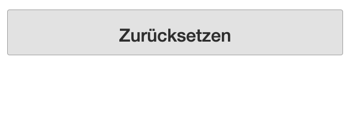
</p>

]


---

.pull-left4[

# Ouputs

<ul>
  <li class="m1"><span>UI-Outputs sind Platzhalter für Inhalte, die vom <high>Server</high> generiert werden.</span></li><br>
  <li class="m2"><span>Der Server generiert die Inhalte mit passenden <highm>render*</highm>-Funktionen</span></li>
</ul>


]

.pull-right5[

<br>
```{r, eval = FALSE, echo = TRUE}

library(shiny)

ui <- fluidPage(
  sidebarLayout(
    sidebarPanel(
      selectInput("variable", 
                  "Wähle eine Variable")
      ),
    mainPanel(
      plotOutput("scatterplot")
      )
    )
  )

server <- function(input, output, session) {
  
  daten <- read_csv("datensatz.csv")
  
  output$scatterplot <- renderPlot({
    plot(daten$x, 
         daten[[input$variable]])
  })
  
}

shinyApp(ui, server)


```
]

---

# Ouputs

.pull-left4[

<ul>
  <li class="m1"><span>UI-Outputs sind Platzhalter für Inhalte, die vom <high>Server</high> generiert werden.</span></li><br>
  <li class="m2"><span>Der Server generiert die Inhalte mit passenden <highm>render*</highm>-Funktionen</span></li>
</ul>

]

.pull-right5[

<table style="cellspacing:0; cellpadding:0; border:none; width:70%">
<col width="20%">
  <col width="60%">
  <tr style="padding:20px;background-color:white">
    <th style="padding:20px;text-align:left">Output<br><font style="font-weight:100">(in UI)</font></td>
    <th style="padding:20px;text-align:left">Render<br><font style="font-weight:100">(in Server)</font></td>
  </tr>
  <tr style="padding:20px;background-color:white">
    <td style="padding:20pxr"><mono>textOuput()</mono></td>
    <td><mono>renderText()</mono></td>
  </tr>
  <tr style="padding:20px;background-color:white">
    <td style="padding:20pxr"><mono>htmlOuput()</mono></td>
    <td><mono>renderText()</mono></td>
  </tr> 
  <tr style="padding:20px;background-color:white">
    <td style="padding:20pxr"><mono>plotOuput()</mono></td>
    <td><mono>renderPlot()</mono></td>
  </tr> 
  <tr style="padding:20px;background-color:white">
    <td style="padding:20pxr"><mono>imageOuput()</mono></td>
    <td><mono>renderImage()</mono></td>
  </tr>
  <tr style="padding:20px;background-color:white">
    <td style="padding:20pxr"><mono>tableOuput()</mono></td>
    <td><mono>renderTable()</mono></td>
  </tr>
  <tr style="padding:20px;background-color:white">
    <td style="padding:20pxr"><mono>dataTableOuput()</mono></td>
    <td><mono>renderDataTable()</mono></td>
  </tr>
  <tr style="padding:20px;background-color:white">
    <td style="padding:20pxr"><mono>uiOuput()</mono></td>
    <td><mono>renderUI()</mono></td>
  </tr>
</table>

]


---

# Workflow

.pull-left4[

<ul>
  <li class="m1"><span>Im laufe dieses Kurses werdet ihr viele Apps kreieren. </span></li><br>
  <li class="m2"><span>Workflow</span></li>
  <ul class = "level">
    <li><span>(1) Kreiere App-Templates mit <mono>shinyapp</mono> + Shift + tab</span></li>
    <li><span> (2) Speichere die App</span></li>
    <li><span> (3) Teste mit Cmd/Ctrl + Shift + Enter</span></li>
    <li><span> (4) Teste die App häufig</span></li>
  <ul>
</ul>

]


.pull-right5[

```{r, eval = FALSE}
shinyapp # + Shift + TAB
```

```{r, eval = FALSE}

library(shiny)

ui <- fluidPage(
  
)

server <- function(input, output, session) {
  
}

shinyApp(ui, server)

```

]

---

class: middle, center

<h1><a href="https://therbootcamp.github.io/Shiny_2023CSS/_sessions/ErsteApp/ErsteApp_practical.html">Practical</a></h1>


