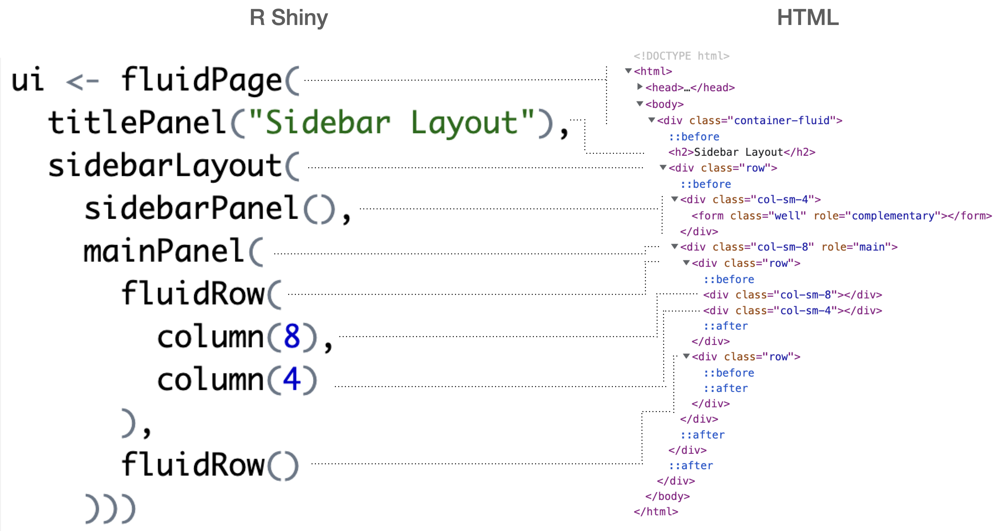

layout: true

<div class="my-footer">
  <span style="text-align:center">
    <span> 
      
    </span>
    <a href="https://therbootcamp.github.io/">
      <span style="padding-left:82px"> 
        <font color="#7E7E7E">
          www.therbootcamp.com
        </font>
      </span>
    </a>
    <a href="https://therbootcamp.github.io/">
      <font color="#7E7E7E">
       Dashboards mit Shiny | März 2023
      </font>
    </a>
    </span>
  </div> 

---

```{r setup, include=FALSE}
options(htmltools.dir.version = FALSE)

#options(width=110)
#options(digits = 4)
```

```{r, echo = FALSE ,message = FALSE, warning = FALSE}
knitr::opts_chunk$set(comment=NA, 
                      echo = TRUE, eval = TRUE, 
                      message = FALSE, warning = FALSE, error = TRUE,
                      fig.align = 'center', dpi = 200)
library(tidyverse)
```


.pull-left4[

# Agenda


<ul>
  <li class="m1"><span>Einseitige Layouts</span></li>
  <li class="m2"><span>Mehrseitige Layouts</span></li>
  <li class="m3"><span>HTML / CSS</span></li>
</ul>

<br>


]

.pull-right5[
<br><br><br>
<p align = "center">
  
</p>

]
---

# Layoutelemente

.pull-left4[

<ul>
  <li class="m1"><span>Layouts können ein- oder mehrseitig sein</span></li>
  <li class="m2"><span>Die einzelnene Elemente können <high>flexibel kombinert</high> werden</span></li>
</ul>

]

.pull-right5[

<table style="cellspacing:0; cellpadding:0; border:none; width:70%">
<col width="20%">
  <col width="60%">
  <tr style="padding:20px;background-color:white">
    <th style="padding:20px;text-align:left">Kategorie</td>
    <th style="padding:20px;text-align:left">Funktion</td>
  </tr>
  <tr style="padding:20px;background-color:white">
    <td style="padding:20pxr">Page</td>
    <td><mono>fluidPage() fixedPage()</mono></td>
  </tr>
  <tr style="padding:20px;background-color:white">
    <td style="padding:20pxr">Layouts</td>
    <td><mono>sidebarLayout() splitLayout() verticalLayout</mono></td>
  </tr> 
  <tr style="padding:20px;background-color:white">
    <td style="padding:20pxr">Panels</td>
    <td><mono>titlePanel() mainPanel() sidebarPanel() fixedPanel()</mono></td>
  </tr>
  <tr style="padding:20px;background-color:white">
    <td style="padding:20pxr">Grid</td>
    <td><mono>fluidRow() fixedRow() column()</mono></td>
  </tr>
  <tr style="padding:20px;background-color:white">
    <td style="padding:20pxr">Mehrseiten</td>
    <td><mono>tabsetPanel() navlistPanel()  navbarPage()</mono></td>
  </tr>
</table>


]

---

.pull-left4[

# Pages

<ul>
  <li class="m1"><span>Page-Funktionen kreieren leere HTML-Seite</span></li>
  <li class="m2"><span>Funktionen variieren darin wie sie mit unterschiedlichen <high>Displaygrössen</high> umgehen.</span></li>
</ul>

<br>
```{r, eval = FALSE}

ui <- fluidPage()

```


]

.pull-right5[

<br><br><br>
<p align = "center">
  
</p>

]

---

.pull-left4[

# Layout

<ul>
  <li class="m1"><span>Layout-Funktionen <high>strukturieren</high> die HTML-Seite</span></li>
  <li class="m2"><span>Funktionen variieren darin wie sie die Seite strukturieren.</span></li>


</ul>

<br>
```{r, eval = FALSE}

ui <- fluidPage(
  sidebarLayout(sidebarPanel = ..., 
                mainPanel = ... ,
                position = ...)
)

```


]

.pull-right5[

<br><br><br>
<p align = "center">
  
</p>

]


---

.pull-left4[

# Panels

<ul>
  <li class="m1"><span>Panels kreieren spezifische Container innerhalb der HTML-Seite oder Layoutstruktur</span></li>
  <li class="m2"><span>Panels können innerhalb oder ausserhalb von Layouts plaziert werden.</span></li>


</ul>

<br>
```{r, eval = FALSE}

ui <- fluidPage(
  titlePanel("Sidebar Layout"),
  sidebarLayout(sidebarPanel(), 
                mainPanel())
)

```


]

.pull-right5[

<br><br><br>
<p align = "center">
  
</p>

]

---

.pull-left4[

# Grid

<ul>
  <li class="m1"><span><mono>*Row</mono> und <mono>column</mono> Funktionen kreieren ein Container-Grid</span></li>
  <li class="m2"><span>Funktionieren auf jeder Ebene.</span></li>
  <li class="m3"><span><mono>column</mono> addieren zu 12</span></li>
</ul>

<br>
```{r, eval = FALSE}

ui <- fluidPage(
  titlePanel("Sidebar Layout"),
  sidebarLayout(
    sidebarPanel(), 
    mainPanel(
      fluidRow(
        column(8),
        column(4)
        ),
      fluidRow()
      )))

```


]

.pull-right5[

<br><br><br>
<p align = "center">
  
</p>

]


---

# Tabs

.pull-left4[

<ul>
  <li class="m1"><span>Tabs kreieren ein mehrseitiges Layout innerhalb einer Seite</span></li>
  <li class="m2"><span>Die Tab-Seiten sind <high>Panels</high></span></li>
</ul>

<br>
```{r, eval = FALSE}

ui <- fluidPage(
  titlePanel("Tabset Layout"),
  tabsetPanel(
    tabPanel("Panel A",
             "Das ist Panel A"),
    tabPanel("Panel B",
             "Das ist Panel B"),
    tabPanel("Panel C",
             "Das ist Panel C")
    )
  )

```


]

.pull-right5[

<iframe width = "400px" height = "440px" src = "https://dirkwulff.shinyapps.io/tabset"></iframe>

]

---

# Navlist

.pull-left4[

<ul>
  <li class="m1"><span>Navlist kreieren ein mehrseitiges Layout innerhalb einer Seite</span></li>
  <li class="m2"><span>Die List-Seiten sind <high>Panels</high></span></li>
</ul>

<br>
```{r, eval = FALSE}

ui <- fluidPage(
  titlePanel("Nalist Layout"),
  navlistPanel(
    tabPanel("Panel A",
             "Das ist Panel A"),
    tabPanel("Panel B",
             "Das ist Panel B"),
    tabPanel("Panel C",
             "Das ist Panel C")
    )
  )

```


]

.pull-right5[

<iframe width = "400px" height = "440px" src = "https://dirkwulff.shinyapps.io/navlist"></iframe>

]

---

# Navbar

.pull-left4[

<ul>
  <li class="m1"><span>Navbar ist (anders als Tabset oder Navbar) eine <high>Seite</high>.</span></li>
  <li class="m2"><span>Die Tab-Seiten sind <high>Panels</high></span></li>
</ul>

<br>
```{r, eval = FALSE}

ui <- navbarPage(
    title = "Navbar Page"
    tabPanel("Panel A",
             "Das ist Panel A"),
    tabPanel("Panel B",
             "Das ist Panel B"),
    tabPanel("Panel C",
             "Das ist Panel C")
    )

```


]

.pull-right5[

<iframe width = "400px" height = "440px" src = "https://dirkwulff.shinyapps.io/navbar"></iframe>

]

---

.pull-left25[

# HTML

<ul>
  <li class="m1"><span>Shiny wird in HTML, CSS und JavaScript <high>übersetzt</high></span></li>
  <li class="m2"><span>Shiny is kompatibel mit Code in diesen Sprachen</high></span></li>
  <li class="m3"><span>Shiny verwendet das <a href="https://getbootstrap.com/">Bootstrap</a> Framework</high></span></li>
</ul>

]

.pull-right65[
<br><br><br><br>
<p align = "center">
  
</p>

]

---

.pull-left3[

# <mono>tags</mono>

<ul>
  <li class="m1"><span>Die <mono>tags</mono> Liste stellt alle geläufigen <high>HTML-tags</high> zur Verfügung</span></li>
  <li class="m2"><span>Diese <mono>tags</mono> können mit Shiny <high>austauschbar</high> verwendet werden.</span></li>
</ul>

]

.pull-right6[

```{r, echo = FALSE}
options(max.print = 72, width = 70)
```


```{r}
library(shiny)
names(tags)
```


]

---

# HTML

.pull-left4[

<ul>
  <li class="m1"><span>Die <mono>tags</mono> Liste stellt alle geläufigen <high>HTML-tags</high> zur Verfügung</span></li>
  <li class="m2"><span>Diese <mono>tags</mono> können mit Shiny <high>austauschbar</high> verwendet werden.</span></li>
</ul>


```{r, eval = FALSE}
ui <- tags$html(
  tags$body(
    tags$div(
      tags$p(
        "Hier ist ein Link zum", 
        tags$a(href="www.therbootcamp.com", 
               "The R Bootcamp")
        )
      )
    )
  )
```


]

.pull-right5[

<iframe width = "400px" height = "440px" src = "https://dirkwulff.shinyapps.io/tags"></iframe>

]


---

class: middle, center

<h1><a href="https://therbootcamp.github.io/Shiny_2023CSS/_sessions/Layout/Layout_practical.html">Practical</a></h1>


