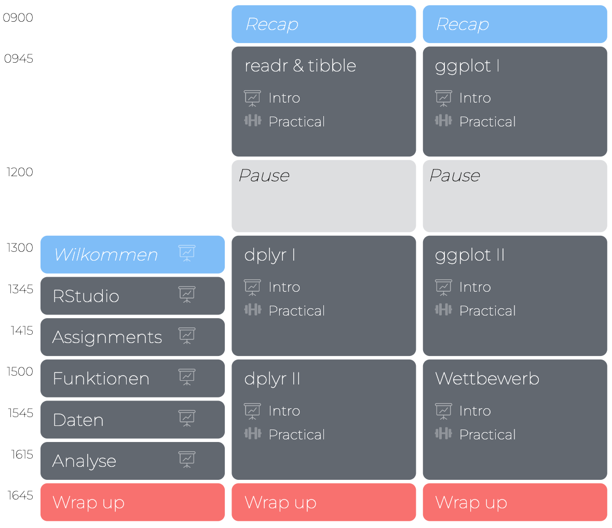
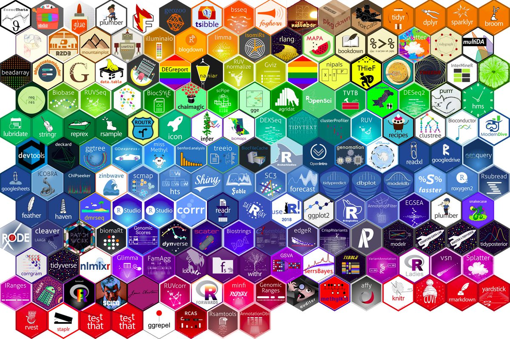

layout: true

<div class="my-footer">
  <span style="text-align:center">
    <span> 
      
    </span>
    <a href="https://therbootcamp.github.io/">
      <span style="padding-left:82px"> 
        <font color="#7E7E7E">
          www.therbootcamp.com
        </font>
      </span>
    </a>
    <a href="https://therbootcamp.github.io/">
      <font color="#7E7E7E">
       R 4 Data Science | Dezember 2022
      </font>
    </a>
    </span>
  </div> 

---

```{r setup, include=FALSE}
options(htmltools.dir.version = FALSE)
# see: https://github.com/yihui/xaringan
# install.packages("xaringan")
# see: 
# https://github.com/yihui/xaringan/wiki
# https://github.com/gnab/remark/wiki/Markdown
options(width=110)
options(digits = 4)
library(tidyverse)
```


.pull-left35[

<br><br><br><br><br>

# Congratulations!

Nach 2.5 Tagen kennt ihr nun die Grundlagen von R und des Tidyverse!

]

.pull-right55[
<br><br>

]

---

.pull-left2[

# R & tidyverse können noch mehr

]

.pull-right75[

<p align = "center">
  <br><br>
  </img><br>
  <font style="font-size:10px">from <a href="https://twitter.com/mitchoharawild/status/1007297976711110659">twitter.com/mitchoharawild</a></font>
</p>

]


---

# Bücher  

Hier ist eine unvollständige Liste guter Bücher über R lose geordnet nach vorausgesetzter Erfahrung.<br><br>

<table width="80%" style="cellspacing:0; cellpadding:0; border:none;">

  <tr>    

  <td> 
  <a href="http://r4ds.had.co.nz/"></a>
  </td>

  <td>
  <a href="https://covers.oreillystatic.com/images/0636920028574/cat.gif"></a>
  </td>

  <td> 
  <a href="https://ggplot2-book.org/"></a>
  </td>

  <td>
  <a href="https://www.springer.com/de/book/9783540799979"></a>
  </td>
  
  <td>
  <a href="https://bookdown.org/ndphillips/YaRrr/"></a>
  </td>
  
  <td>
  <a href="https://www.orellfuessli.ch/shop/home/artikeldetails/ID35367941.html?ProvID=10917736&gclid=Cj0KCQiAg_HhBRDNARIsAGHLV5238Q26gQmFttHRnYGjcAhz4CslStb-3qBegvuZS5gnCpWSLNlQvF0aAgfOEALw_wcB"></a>
  </td>
  
  </tr>
  

  <tr style="background-color:#ffffff">

  <td>
  <a href="http://appliedpredictivemodeling.com/"></a>
  </td>
  
  <td>
  <a href="http://www-bcf.usc.edu/~gareth/ISL/ISLR%20First%20Printing.pdf"></a>
  </td>
  
  <td>
  <a href="https://www.manning.com/books/deep-learning-with-r"></a>
  </td>


  <td>
  <a href="https://csgillespie.github.io/efficientR/"></a>
  </td>

  <td>
  <a href="www.rcpp.org/"></a>
  </td>
  
  
  <td>
  <a href="http://adv-r.had.co.nz/"></a>
  </td>


  </tr>
  


</table>
<br>


---

# Weiterführende Kurse


<table class="tg"  style="cellspacing:0; cellpadding:0; border:none;">
<tr valign="top">
  <col width="20%">
  <col width="20%">
  <col width="20%">
  <col width="20%">
  <col width="20%">
  <td>
    <p align="center">
      <a class="project-link" href="https://therbootcamp.github.io/#courses" align="center">
      <font style="font-size:20px;weight:700"><br>Einführung in die moderne Datenanalyse mit R</font><br>
      <br>
      </img><br><br>
      
    </p>
  </td>
  <td>
    <p align="center">
      <a class="project-link" href="https://therbootcamp.github.io/#courses" align="center">
      <font style="font-size:20px;weight:700"><br>Explorative Datenanalyse mit R<br></font><br>
      <br>
      </img><br><br>

    </p>
  </td>
  <td>
    <p align="center">
      <a class="project-link" href="https://therbootcamp.github.io/#courses" align="center">
      <font style="font-size:20px;weight:700"><br>Statistik mit R<br><br></font><br>
      <br>
      </img><br><br>

      </a>
    </p>
  </td>
  <td>
    <p align="center">
      <a class="project-link" href="https://therbootcamp.github.io/#courses" align="center">
      <font style="font-size:20px;weight:700"><br>Maschinelles Lernen mit R<br></font><br>
      <br>
      </img><br><br>

      </a>
    </p>
  </td>
  <td>
    <p align="center">
      <a class="project-link" href="https://therbootcamp.github.io/#courses" align="center">
      <font style="font-size:20px;weight:700"><br>Reporting mit R<br><br></font><br>
      <br>
      </img><br><br>

      </a>
    </p>
  </td>
  </tr>


---

.pull-left45[
# Bitte gebt uns Feedback
<br><br>

<p align = "center">
  </img><br>
  <font style="font-size:10px">from <a href="https://cdn-images-1.medium.com/max/1600/1*5OZNYAfzDZfM1lwJBZEuHQ.png">medium.com</a></font>
</p>

]

.pull-right45[

<p align="center"><br><br>
<iframe src="https://docs.google.com/forms/d/e/1FAIpQLSd7uykwaUaEyPUNtEgZ2oBP2urN3dIewghHR8MO4If8jFmQOw/viewform?embedded=true" width="430" height="550" frameborder="0" marginheight="0" marginwidth="0">Loading…</iframe></p>

]


---
class: center, middle

# Herzlichen Dank!

