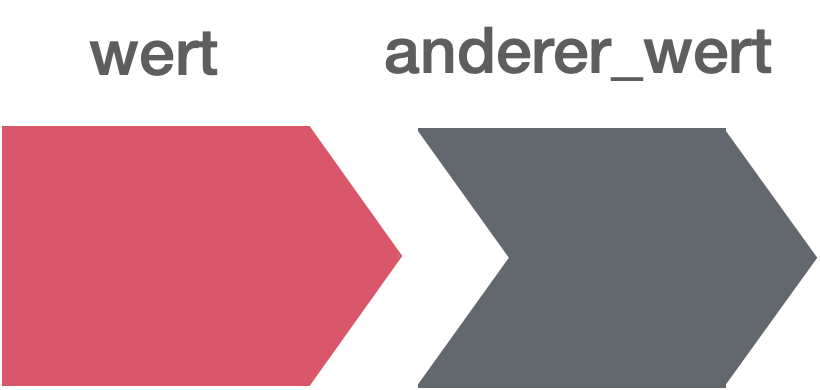
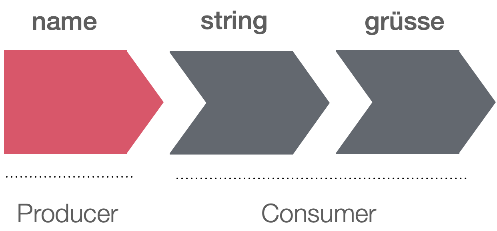

layout: true

<div class="my-footer">
  <span style="text-align:center">
    <span> 
      
    </span>
    <a href="https://therbootcamp.github.io/">
      <span style="padding-left:82px"> 
        <font color="#7E7E7E">
          www.therbootcamp.com
        </font>
      </span>
    </a>
    <a href="https://therbootcamp.github.io/">
      <font color="#7E7E7E">
       Dashboards mit Shiny | März 2023
      </font>
    </a>
    </span>
  </div> 

---


```{r setup, include=FALSE}
options(htmltools.dir.version = FALSE)

#options(width=110)
#options(digits = 4)
```

```{r, echo = FALSE ,message = FALSE, warning = FALSE}
knitr::opts_chunk$set(comment=NA, 
                      echo = TRUE, eval = TRUE, 
                      message = FALSE, warning = FALSE, error = TRUE,
                      fig.align = 'center', dpi = 200)
library(tidyverse)
```


.pull-left3[

# Agenda


<ul>
  <li class="m1"><span>Reaktivität Progammieren</span></li>
  <li class="m2"><span>Reaktiver Graph</span></li>
  <li class="m3"><span>Reaktive Funktionen</span></li>
  <ul class = "level">
    <li><span><mono>reactive</mono></span></li>
    <li><span><mono>reactiveVal, reactiveValues</mono></span></li>
    <li><span><mono>observeEvent</mono></span></li>
    <li><span><mono>evenReactive</mono></span></li>
    <li><span><mono>observe</mono></span></li>
    <li><span><mono>req</mono></span></li>
    <li><span><mono>isolate</mono></span></li>
  </ul>
</ul>

<br>


]

.pull-right6[
<br><br><br>
<p align = "center">
  <br>
  from <a href="https://unsplash.com/photos/ETRPjvb0KM0">unsplash.com</>
</p>

]

---

# Reaktives Programmieren

.pull-left5[

<ul>
  <li class="m1"><span>Ein fundamental anderes Paradigma zu Programmieren</span></li>
  <li class="m2"><span>Eigenschaften</span></li>
  <ul class = "level">
    <li><span><high>Effizient</high> und performant</span></li>
    <li><span>Code ist <high>komplex</high>, Verhalten schwer vorherzusagen</span></li>
  </ul>
</ul>

]

.pull-right5[

```{r}

library(shiny)
reactiveConsole(TRUE)

wert <- reactiveVal(10)
wert() 

wert(20)
wert() 

wert() <- 10
```

]

---

# Reaktives Programmieren

.pull-left5[

<ul>
  <li class="m1"><span>Ein fundamental anderes Paradigma zu Programmieren</span></li>
  <li class="m2"><span>Eigenschaften</span></li>
  <ul class = "level">
    <li><span><high>Effizient</high> und performant</span></li>
    <li><span>Code ist <high>komplex</high>, Verhalten schwer vorherzusagen</span></li>
  </ul>
</ul>

]

.pull-right5[

```{r}

library(shiny)
reactiveConsole(TRUE)

anderer_wert <- reactive({wert() + 10})
anderer_wert() 

wert(50)
anderer_wert() 

```

]

---

# Reaktiver Graph

.pull-left4[

<ul>
  <li class="m1"><span>Reaktive Elemente haben <high>gerichtete Beziehungen</high> zueinander</span></li>
  <li class="m2"><span>Wenn sich ein Element ändert, dann ändert sich auch das Element, dass von ihm abhängt</span></li>
  <li class="m3"><span>Reaktive Elemente bleiben im <high>Cache</high>, solange sie nicht verändert werden</span></li>
</ul>

<br>
<p align = "center">
  
</p>

]

.pull-right5[

```{r}

library(shiny)
reactiveConsole(TRUE)

wert <- reactiveVal(10)
anderer_wert <- reactive({wert() + 10})
anderer_wert()

wert(20)
anderer_wert()
```
]


---

# Reaktiver Graph

.pull-left4[

<ul>
  <li class="m1"><span>Reaktive Elemente haben <high>gerichtete Beziehungen</high> zueinander</span></li>
  <li class="m2"><span>Wenn sich ein Element ändert, dann ändert sich auch das Element, dass von ihm abhängt</span></li>
  <li class="m3"><span>Reaktive Elemente bleiben im <high>Cache</high>, solange sie nicht verändert werden</span></li>
</ul>

<br>
<p align = "center">
  
</p>

]

.pull-right5[

```{r, eval = FALSE}

library(shiny)

ui <- fluidPage(
  textInput("name", "Wie heisst Du?"),
  textOutput("grüsse")
)

server <- function(input, output, session) {
  string = reactive(input$name)
  
  output$greeting <- renderText({
    paste0("Hallo ", string(), "!")
  })
}

shinyApp(ui, server)

```
]

---

# Reaktive Funktionen

.pull-left4[

<ul>
  <li class="m1"><span>Mehrere reaktiver Funktionen für <high>verschiedene Zwecke</high></span></li>
  <li class="m2"><span>Ermöglichen <high>komplexe Interaktionen</high></span></li>
  <li class="m3"><span>Denken als Funktionen</high></span></li>
</ul>

<table style="cellspacing:0; cellpadding:0; border:none; width:70%">
<col width="20%">
  <col width="60%">
  <tr style="padding:20px;background-color:white">
    <td style="padding:20px;text-align:center">Objekt</td>
    <td><mono>reactive(), eventReactive()</mono></td>
  </tr>
  <tr style="padding:20px;background-color:white">
    <td style="padding:20px;text-align:center">Überschreibare(s) Objekt(e)</td>
    <td><mono>reactiveVal() reactiveValues()</mono></td>
  </tr> 
  <tr style="padding:20px;background-color:white">
    <td style="padding:20px;text-align:center">Bedingungen</td>
    <td><mono>observeEvent() observe()</mono></td>
  </tr>
  <tr style="padding:20px;background-color:white">
    <td style="padding:20px;text-align:center">Helfer</td>
    <td><mono>req() isolate()</mono></td>
  </tr>
</table>

]


.pull-right5[

<p align = "center">
  
</p>

]

---

# <mono>reactive</mono>

.pull-left4[

<ul>
  <li class="m1"><span><mono>reactive()</mono> kreiert ein "einfaches" reaktives Objekte</span></li>
  <li class="m2"><span>Ein <mono>reactive</mono> kann nicht überschrieben werden.</span></li>
</ul>

]

.pull-right5[

```{r, eval = FALSE}

library(shiny)

ui <- fluidPage(
  textInput("name", "Wie heisst Du?"),
  textOutput("grüsse")
)

server <- function(input, output, session) {
  string = reactive(input$name)
  
  output$grüsse <- renderText({
    paste0("Hallo ", string(), "!")
  })
}

shinyApp(ui, server)

```
]


---

# <mono>reactive</mono>

.pull-left4[

<ul>
  <li class="m1"><span><mono>reactive()</mono> kreiert ein "einfaches" reaktives Objekt</span></li>
  <li class="m2"><span>Ein <mono>reactive</mono> kann nicht überschrieben werden.</span></li>
</ul>

]

.pull-right5[

<iframe width = "400px" height = "440px" src = "https://dirkwulff.shinyapps.io/reactive/"></iframe>

]


---

# <mono>eventReactive</mono>

.pull-left4[

<ul>
  <li class="m1"><span><mono>eventReactive()</mono> kreiert eine <mono>reactive</mono> in Abhängigkeit einer Bedingung</span></li>
</ul>

]

.pull-right5[

```{r, eval = FALSE}

library(shiny)

ui <- fluidPage(
  textInput("name", "Wie heisst Du?"),
  actionButton("grüsse_mich", "Grüsse mich"),
  textOutput("grüsse")
)

server <- function(input, output, session) {
  string = eventReactive(input$grüsse_mich,
                         {input$name})
  
  output$grüsse <- renderText({
    paste0("Hallo ", string(), "!")
  })
}

shinyApp(ui, server)

```
]


---

# <mono>eventReactive</mono>

.pull-left4[

<ul>
  <li class="m1"><span><mono>eventReactive()</mono> kreiert eine <mono>reactive</mono> in Abhängigkeit einer Bedingung</span></li>
</ul>

]

.pull-right5[

<iframe width = "400px" height = "440px" src = "https://dirkwulff.shinyapps.io/eventReactive/"></iframe>

]

---

# <mono>reactiveVal(ues)</mono>

.pull-left4[

<ul>
  <li class="m1"><span><mono>reactiveVal()</mono> und <mono>reactiveValues()</mono> kreieren überschreibbare <mono>reactives</mono></span></li>
  <li class="m2"><span><mono>reactiveValues()</mono> ist eine Generalisierung von <mono>reactiveVal()</mono>, die <high>mehrere Elemente</high> erlaubt und wie eine <mono>list</mono> funktioniert</span></li>
</ul>

]

.pull-right5[

```{r, eval = FALSE}

library(shiny)

ui <- fluidPage(
  textInput("name", "Wie heisst Du?"),
  actionButton("grüsse_mich", "Grüsse mich"),
  textOutput("grüsse")
)

server <- function(input, output, session) {
  string = reactiveVal()
  observeEvent(input$grüsse_mich, {
    string(paste0("Hallo ", input$name, "!"))
  })
  
  output$grüsse <- renderText(string())
}

shinyApp(ui, server)

```


]

---

# <mono>reactiveVal(ues)</mono>

.pull-left4[

<ul>
  <li class="m1"><span><mono>reactiveVal()</mono> und <mono>reactiveValues()</mono> kreieren überschreibbare <mono>reactives</mono></span></li>
  <li class="m2"><span><mono>reactiveValues()</mono> ist eine Generalisierung von <mono>reactiveVal()</mono>, die <high>mehrere Elemente</high> erlaubt und wie eine <mono>list</mono> funktioniert</span></li>
</ul>

]

.pull-right5[

```{r, eval = FALSE}

library(shiny)

ui <- fluidPage(
  textInput("name", "Wie heisst Du?"),
  actionButton("grüsse_mich", "Grüsse mich"),
  textOutput("grüsse")
)

server <- function(input, output, session) {
  string = reactiveValues()
  observeEvent(input$grüsse_mich, {
    string$x = paste0("Hallo ", input$name, "!")
  })
  
  output$grüsse <- renderText(string$x)
}

shinyApp(ui, server)

```


]

---

# <mono>observeEvent</mono>

.pull-left4[

<ul>
  <li class="m1"><span><mono>observeEvent()</mono> ist eine Art <highm>if-statement</highm> für reaktive Objekte</span></li>
  <li class="m2"><span>Der Code von <mono>observeEvent</mono> wird nur ausgeführt, wenn die Bedingung invalidiert wird</span></li>
</ul>

]

.pull-right5[

```{r, eval = FALSE}

library(shiny)

ui <- fluidPage(
  textInput("name", "Wie heisst Du?"),
  actionButton("grüsse_mich", "Grüsse mich"),
  textOutput("grüsse")
  )

server <- function(input, output, session) {
  string = reactiveVal()
  observeEvent(input$grüsse_mich, {
    string(paste0("Hallo ", input$name, "!"))
    })
  
  output$grüsse <- renderText(string())
  }

shinyApp(ui, server)

```


]

---

# <mono>observeEvent</mono>

.pull-left4[

<ul>
  <li class="m1"><span><mono>observeEvent()</mono> ist eine Art <highm>if-statement</highm> für reaktive Objekte</span></li>
  <li class="m2"><span>Der Code von <mono>observeEvent</mono> wird nur ausgeführt, wenn die Bedingung invalidiert wird</span></li>
</ul>

]


.pull-right5[

<iframe width = "400px" height = "440px" src = "https://dirkwulff.shinyapps.io/observeEvent/"></iframe>

]


---

# <mono>req</mono>

.pull-left4[

<ul>
  <li class="m1"><span><mono>req()</mono> steht für <i>required</i> und kann auf verschiedene Wege als Bedingung eingesetzt werden</span></li>
  <li class="m2"><span>Es kann identifizieren, ob ein Input bereits verwendet wurde</span></li>
</ul>

]

.pull-right5[

```{r, eval = FALSE}

library(shiny)

ui <- fluidPage(
  textInput("name", "Wie heisst Du?"),
  textOutput("grüsse")
)

server <- function(input, output, session) {

  output$grüsse <- renderText(
    paste("Hallo", req(input$name))
    )
  
}

shinyApp(ui, server)

```


]

---

# <mono>req</mono>

.pull-left4[

<ul>
  <li class="m1"><span><mono>req()</mono> steht für <i>required</i> und auf verschiedene Wege als Bedingung eingesetzt werden</span></li>
  <li class="m2"><span>Es kann identifizieren, ob ein Input bereits verwendet wurde</span></li>
</ul>

]


.pull-right5[

<iframe width = "400px" height = "440px" src = "https://dirkwulff.shinyapps.io/observeEvent2/"></iframe>

]


---

# <mono>observe</mono>, <mono>isolate</mono>

.pull-left4[

<ul>
  <li class="m1"><span><mono>observe()</mono> und <mono>isolate()</mono> sind <high>fortgeschrittenere Tools</high>, die selten zum Einsatz kommen</span></li>
</ul>

]

.pull-right5[

```{r, eval = FALSE}

library(shiny)
reactiveConsole(TRUE)

r <- reactiveValues(count = 0, x = 1)

observe({
  r$x
  r$count <- isolate(r$count) + 1
  })

```

]


---

class: middle, center

<h1><a href="https://therbootcamp.github.io/Shiny_2023CSS/_sessions/Reaktivität/Reaktivität_practical.html">Practical</a></h1>


