layout: true

<div class="my-footer">
  <span style="text-align:center">
    <span> 
      
    </span>
    <a href="https://therbootcamp.github.io/">
      <span style="padding-left:82px"> 
        <font color="#7E7E7E">
          www.therbootcamp.com
        </font>
      </span>
    </a>
    <a href="https://therbootcamp.github.io/">
      <font color="#7E7E7E">
       Dashboards mit Shiny | März 2023
      </font>
    </a>
    </span>
  </div> 

---


```{r setup, include=FALSE}
options(htmltools.dir.version = FALSE)
options(width=110)
options(digits = 4)

knitr::opts_chunk$set(fig.align = 'center')
```

.pull-left3[

# Agenda

<ul>
  <li class="m1"><span>Usability</span></li>
  <li class="m2"><span>shinythemes</span></li>
  <li class="m3"><span>bslib</span></li>
  <li class="m4"><span>Modularität</span></li>
</ul>
]

.pull-right6[
<br><br><br>
<p align = "center">
  <br>
  <font style="font-size:12px">from <a href="https://unsplash.com/photos/ETRPjvb0KM0">unsplash.com</></font>
</p>

]


---

.pull-left3[

# Usability

<ul>
  <li class="m1"><span>Vorteile durch gutes Styling</span>
    <ul class="level">
      <li><span>Bessere Usability</span></li>
      <li><span>Branding</span></li>
      <li><span>Corporate Design</span></li>
    </ul>
</ul>
]

.pull-right6[
<br><br><br>
<p align = "center">
  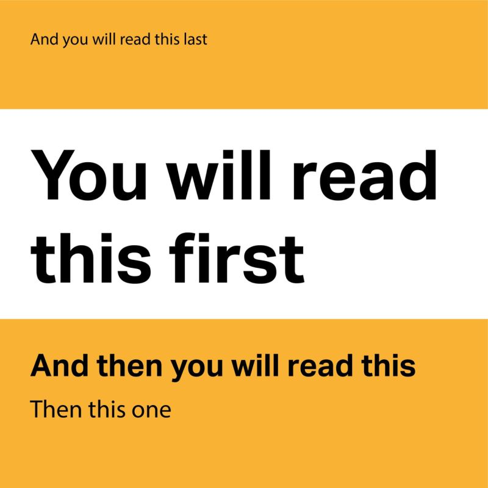<br>
</p>

]

---

# <mono>shinythemes</mono>

.pull-left4[

<ul>
  <li class="m1"><span>Bietet einfaches Theming "out of the box"</span></li><br>
  <li class="m2"><span>Mehrere vordefinierte Themes: siehe <a href="https://rstudio.github.io/shinythemes/">https://rstudio.github.io/shinythemes/</a></span></li>
</ul>


<br>
```{r, eval = FALSE, echo = TRUE}

library(shiny)
library(shinythemes)

ui <- fluidPage(
  theme = shinytheme("default")
  )


```


]

.pull-right5[

<p align="center">
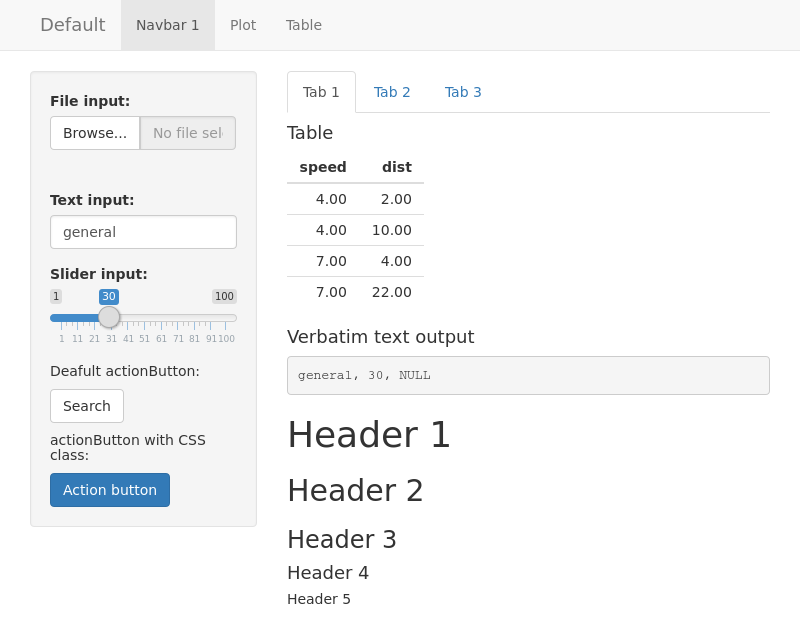<br>
<font style="font-size:10px">from <a href="https://rstudio.github.io/shinythemes/">rstudio.github.io</a></font>
</p>
]

---

# <mono>shinythemes</mono>

.pull-left4[
<ul>
  <li class="m1"><span>Bietet einfaches Theming "out of the box"</span></li><br>
  <li class="m2"><span>Mehrere vordefinierte Themes: siehe <a href="https://rstudio.github.io/shinythemes/">https://rstudio.github.io/shinythemes/</a></span></li>
</ul>

<br>
```{r, eval = FALSE, echo = TRUE}

library(shiny)
library(shinythemes)

ui <- fluidPage(
  theme = shinytheme("lumen")
  )

```


]

.pull-right5[

<p align="center">
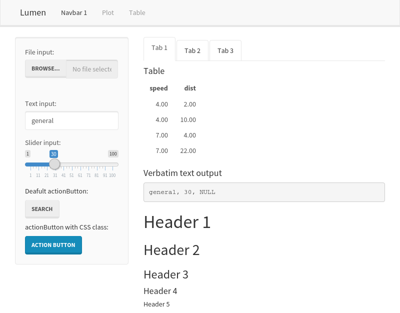<br>
<font style="font-size:10px">from <a href="https://rstudio.github.io/shinythemes/">rstudio.github.io</a></font>
</p>
]

---

# <mono>shinythemes</mono>

.pull-left4[
<ul>
  <li class="m1"><span>Bietet einfaches Theming "out of the box"</span></li><br>
  <li class="m2"><span>Mehrere vordefinierte Themes: siehe <a href="https://rstudio.github.io/shinythemes/">https://rstudio.github.io/shinythemes/</a></span></li>
</ul>

  <br>

```{r, eval = FALSE, echo = TRUE}

library(shiny)
library(shinythemes)

ui <- fluidPage(
  theme = shinytheme("flatly")
  )
```


]

.pull-right5[

<p align="center">
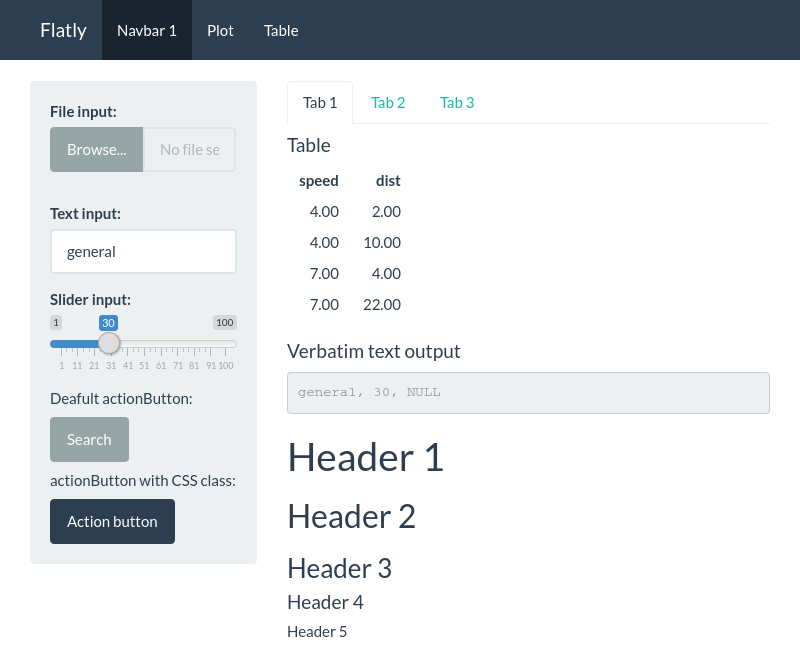<br>
<font style="font-size:10px">from <a href="https://rstudio.github.io/shinythemes/">rstudio.github.io</a></font>
</p>
]


---

# <mono>shinythemes</mono>

.pull-left4[
<ul>
  <li class="m1"><span>Bietet einfaches Theming "out of the box"</span></li><br>
  <li class="m2"><span>Mehrere vordefinierte Themes: siehe <a href="https://rstudio.github.io/shinythemes/">https://rstudio.github.io/shinythemes/</a></span></li><br>

  <br>
</ul>

```{r, eval = FALSE, echo = TRUE}

library(shiny)
library(shinythemes)

ui <- fluidPage(
  theme = shinytheme("superhero")
)
```


]

.pull-right5[

<p align="center">
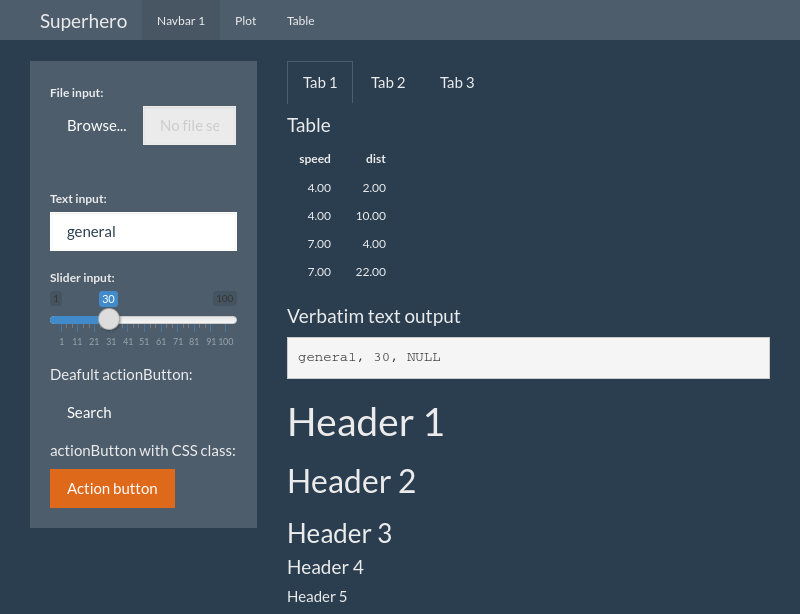<br>
<font style="font-size:10px">from <a href="https://rstudio.github.io/shinythemes/">rstudio.github.io</a></font>
</p>
]


---

# <mono>bslib</mono>

.pull-left35[

<ul>
  <li class="m1"><span>Das <mono>bslib</mono> Paket erlaubt <high>flexibles theming</high></span></li>
  <li class="m2"><span><mono>bs_theme()</mono> bietet viele Argumente</mono></span></li>
</ul>

```{r, eval = FALSE, echo = TRUE}

library(shiny)
library(bslib)

ui <- fluidPage(
  theme = bs_theme(
    version = 3
  )
)

```

]

.pull-right55[

<p align="center">
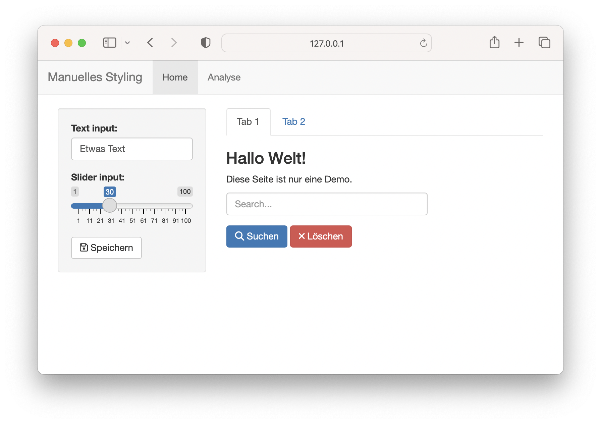
</p>
]

---

# <mono>bslib</mono>

.pull-left35[

<ul>
  <li class="m1"><span>Das <mono>bslib</mono> Paket erlaubt <high>flexibles theming</high></span></li>
  <li class="m2"><span><mono>bs_theme()</mono> bietet viele Argumente</mono></span></li>
</ul>

```{r, eval = FALSE, echo = TRUE}

library(shiny)
library(bslib)

ui <- fluidPage(
  theme = bs_theme(
    version = 3,
    bg = "#0b0f19", 
    fg = "#ffffff"
  )
)

```

]

.pull-right55[

<p align="center">
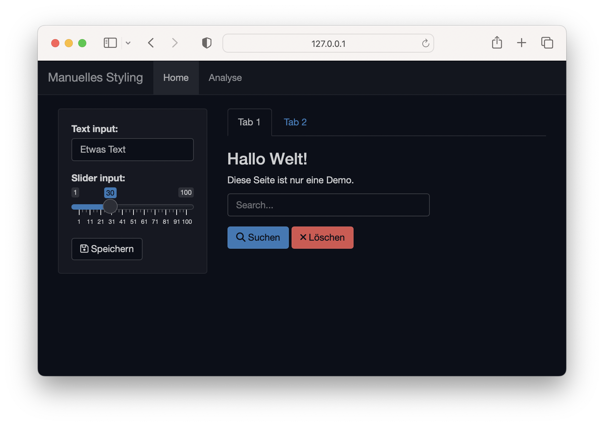
</p>
]


---

# <mono>bslib</mono>

.pull-left3[

<ul>
  <li class="m1"><span>Das <mono>bslib</mono> Paket erlaubt <high>flexibles theming</high></span></li>
  <li class="m2"><span><mono>bs_theme()</mono> bietet viele Argumente</mono></span></li>
</ul>

```{r, eval = FALSE, echo = TRUE}

library(shiny)
library(bslib)

ui <- fluidPage(
  theme = bs_theme(
    version = 3,
    bg = "#0b0f19", 
    fg = "#ffffff",
    primary = "#6366f1",
    danger = "#cf48ef"
  )
)

```

]

.pull-right55[

<p align="center">
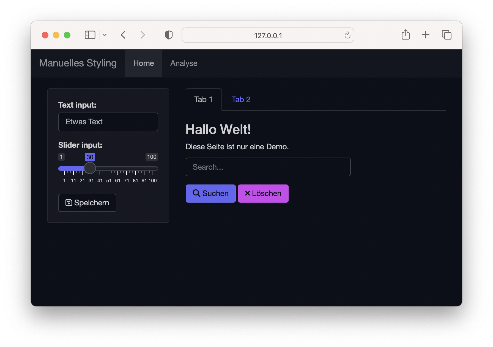
</p>
]

---

# <mono>bslib</mono>

.pull-left35[

<ul>
  <li class="m1"><span>Das <mono>bslib</mono> Paket erlaubt <high>flexibles theming</high></span></li>
  <li class="m2"><span><mono>bs_theme()</mono> bietet viele Argumente</mono></span></li>
</ul>

```{r, eval = FALSE, echo = TRUE}

library(shiny)
library(bslib)

ui <- fluidPage(
  theme = bs_theme(
    version = 3,
    bg = "#0b0f19", 
    fg = "#ffffff",
    primary = "#6366f1",
    danger = "#cf48ef",
    base_font = "Arial",
    heading_font = "Courier"
  )
)

```

]

.pull-right55[

<p align="center">
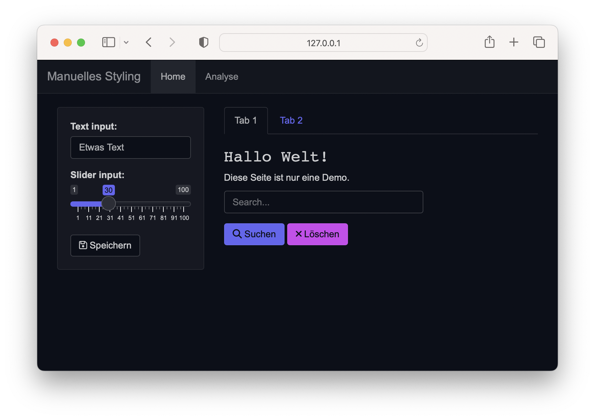
</p>
]

---

# <mono>bslib</bslib>

.pull-left3[

<ul>
  <li class="m1"><span>Das <mono>bslib</mono> Paket erlaubt <high>flexibles theming</high></span></li>
  <li class="m2"><span><mono>bs_theme()</mono> bietet viele Argumente</mono></span></li>
</ul>

```{r, eval = FALSE, echo = TRUE}

library(shiny)
library(bslib)

ui <- fluidPage(
  theme = bs_theme(
    version = 3,
    bg = "#0b0f19", 
    fg = "#ffffff",
    primary = "#6366f1",
    danger = "#cf48ef",
    base_font = "Arial",
    heading_font = "Courier",
    font_scale = 1.2
  )
)

```

]

.pull-right55[

<p align="center">
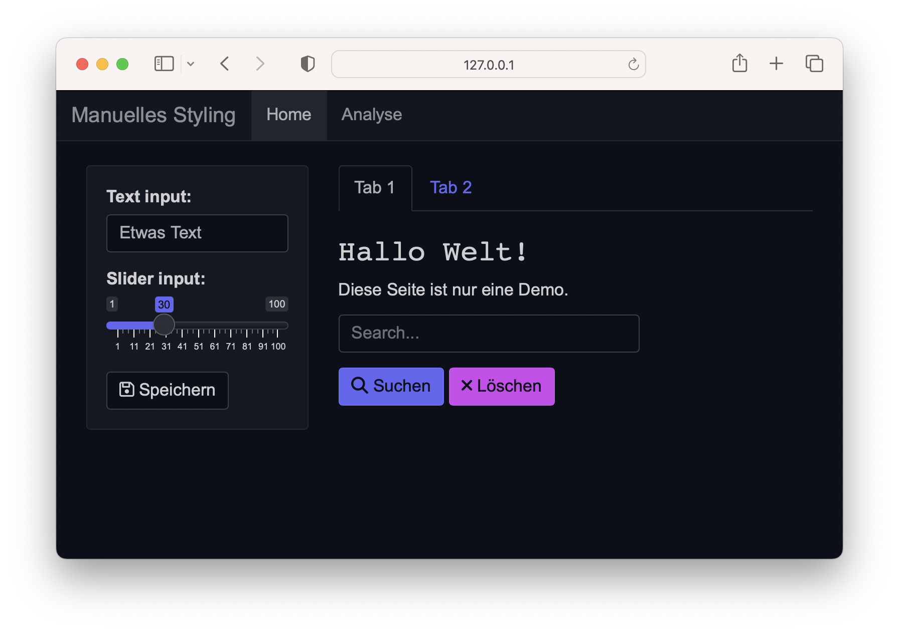
</p>
]

---

# Google Fonts

.pull-left5[
<ul>
  <li class="m1"><span><mono>bslib</mono> erlaubt auch die Benutzung von Google Fonts</span></li>
    <ul class="level">
    <li><span><a href="https://fonts.google.com">https://fonts.google.com</a></span></li>
  </ul>
</ul>
<br>

```{r, eval = FALSE, echo = TRUE}

ui <- fluidPage(
  theme <- bs_theme(
    base_font = font_google("Poppins"),
    code_font = font_google("Fira Code"),
    heading_font = font_google("Tilt Warp")
  )
)

```


]

.pull-right45[
<p align="center">
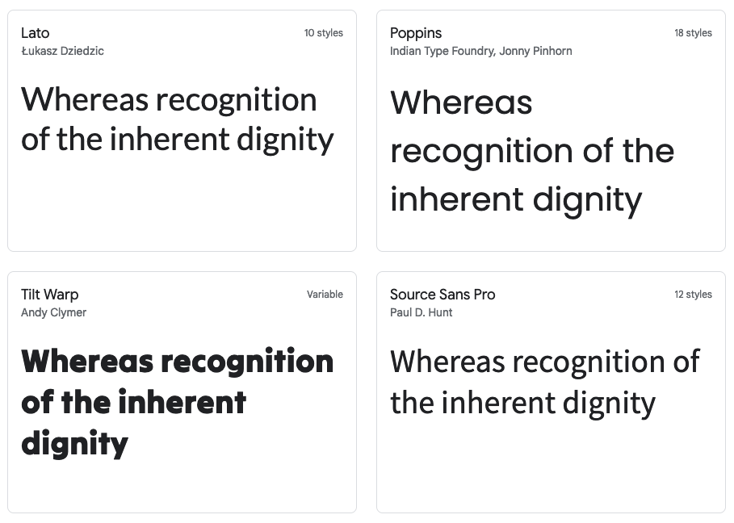<br>
<font style="font-size:10px">from <a href="https://fonts.google.com">https://fonts.google.com</a></font>
</p>
]


---

# Theming

.pull-left3[
<ul>
  <li class="m1"><span>Moderne und ansprechende Themes von Bootswatch</span></li>
  <ul class="level">
    <li><span><a href="https://bootswatch.com/">https://bootswatch.com/</a></span></li>
    </ul>
  <li class="m2"><span>Aktuellere Versionen des UI Frameworks Bootstrap</span></li>
</ul>


```{r, eval = FALSE, echo = TRUE}

ui <- fluidPage(
  theme = bs_theme(
    bootswatch = "quartz"
    )
)

```


]

.pull-right65[
<p align="center">
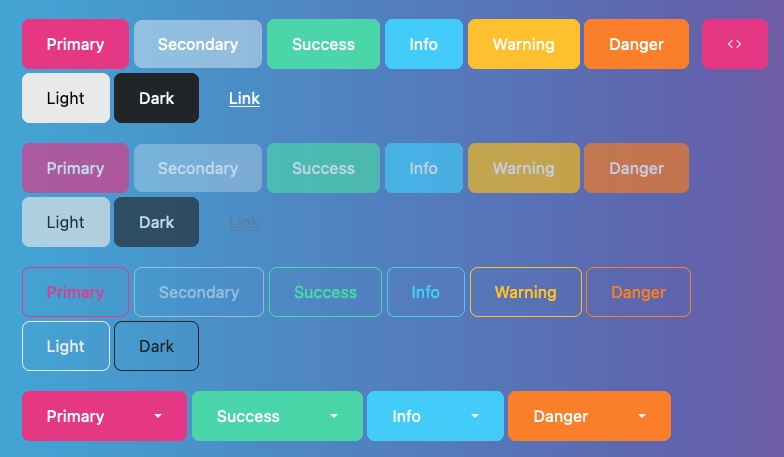<br>
<font style="font-size:10px">from <a href="https://rstudio.github.io/bslib/articles/bslib.html">rstudio.github.io</a></font>
</p>
]

---

# Interaktive theme previews

.pull-left3[
<ul>
  <li class="m1"><span>Kann eine interaktive Preview App zeigen um Themes zu testen</span></li>
</ul>

```{r, eval=FALSE, echo=TRUE}
library(bslib)
bs_theme_preview(
  theme = bs_theme()
  )
```

]

.pull-right65[
<p align="center">
<br>
<font style="font-size:10px">from <a href="https://rstudio.github.io/bslib/articles/bslib.html">rstudio.github.io</a></font>
</p>
]

---
class: middle, center

<h1><a href=https://therbootcamp.github.io/Shiny_2023CSS/index.html>Agenda</a></h1>
