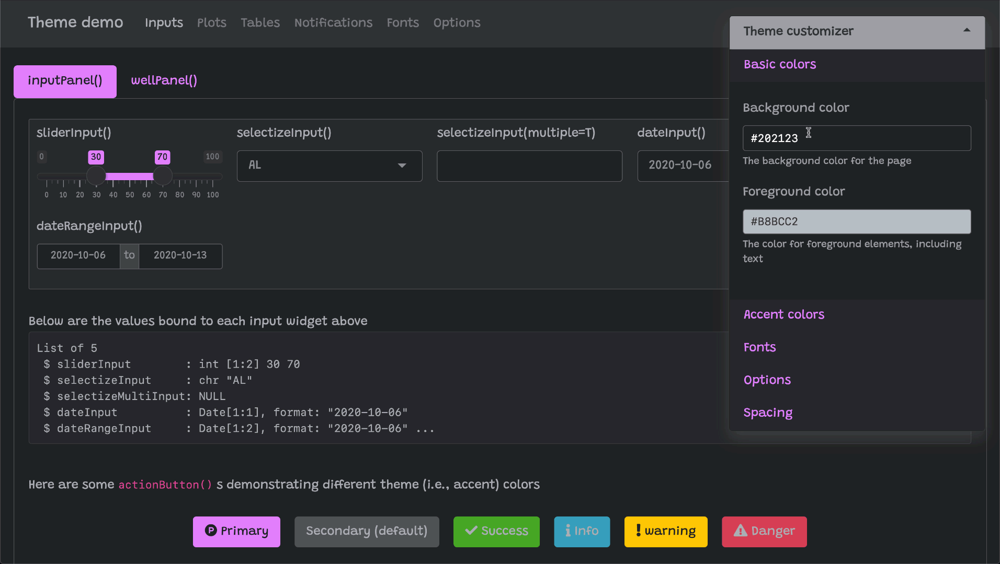

layout: true

<div class="my-footer">
  <span style="text-align:center">
    <span> 
      
    </span>
    <a href="https://therbootcamp.github.io/">
      <span style="padding-left:82px"> 
        <font color="#7E7E7E">
          www.therbootcamp.com
        </font>
      </span>
    </a>
    <a href="https://therbootcamp.github.io/">
      <font color="#7E7E7E">
       Dashboards mit Shiny | März 2023
      </font>
    </a>
    </span>
  </div> 

---


```{r setup, include=FALSE}
options(htmltools.dir.version = FALSE)
options(width=110)
options(digits = 4)

knitr::opts_chunk$set(fig.align = 'center')
```

.pull-left3[

# Einleitung
<ul>
  <li class="m1">
    <span>Was ist mit Styling gemeint?</span>
    <ul class="level">
      <li><span>Aussehen des User Interfaces</span></li>
      <li><span>Farben, Fonts, Aussehen der Elemente</span></li>
    </ul>
  </li>
  <br>
  <li class="m2"><span>Was wird damit erreicht?</span></li>
    <ul class="level">
      <li><span>bessere User Experience</span></li>
      <li><span>Branding</span></li>
      <li><span>Corporate Design</span></li>
    </ul>
</ul>
]

.pull-right6[
<br><br>
<p align="center">
<br>
<font style="font-size:10px">from <a href="https://www.behance.net/gallery/146851995/Design-System-Free-Download">behance.net</a></font>
</p>
]

---

.pull-left3[
# Default Style
<ul>
  <li class="m1">
    <span>Den default Style kennt ihr schon</span>
    <ul class="level">
      <li><span>macht vieles gut</span></li>
      <li><span>eignet sich bestens zum entwickeln der App</span></li>
    </ul>
  </li>
  <li class="m2"><span>ist standardmässig aktiv</span></li>
</ul>
]

.pull-right6[
<br>
<p align="center">
<br>
<font style="font-size:10px">from <a href="https://rstudio.github.io/shinythemes/">rstudio.github.io</a></font>
</p>
]

---

# Theming mit <mono>shinythemes</mono>

.pull-left4[
<ul>
  <li class="m1"><span>bietet einfaches Theming "out of the box"</span></li><br>
  <li class="m2"><span>funktioniert in Umgebungen mit eingeschränktem Internetzugang</span></li>
  <br>
</ul>
]

.pull-right5[
<p align="center">
<br>
<font style="font-size:10px">from <a href="https://rstudio.github.io/shinythemes/">rstudio.github.io</a></font>
</p>
]

---

# Theme benutzen

.pull-left4[
<ul>
  <li class="m1"><span>Package <mono>shinythemes</mono> muss einmalig installiert werden</span></li>
  <br>
  <li class="m2"><span>Danach muss das Paket in <mono>app.R</mono> geladen werden</span></li>
  <br>
  <li class="m3"><span>und dem Argument <mono>theme</mono> in der Funktion <mono>fluidPage()</mono> die Funktion <mono>shinytheme("THEME-NAME")</mono> zugewiesen werden.</span></li>
</ul>
]

.pull-right5[

```{r, eval = FALSE, echo = TRUE}
install.packages("shinythemes")
```

in <mono>app.R</mono>:
```{r, eval = FALSE, echo = TRUE}

library(shiny)
library(shinythemes)

ui <- fluidPage(
  theme = shinytheme("THEME-NAME")
)

server <- function(input, output, session) {}

shinyApp(ui, server)

```

]

---

# Theme auswählen

.pull-left4[
<ul>
  <li class="m1"><span>Ein passendes Theme auswählen</span>
    <ul class="level">
      <li><span>auf der Website <a href="https://rstudio.github.io/shinythemes/">https://rstudio.github.io/shinythemes/</a></span></li>
      <li><span>oder interaktiv ausprobieren auf <a href="https://gallery.shinyapps.io/117-shinythemes/">https://gallery.shinyapps.io/117-shinythemes/</a></span></li>
    </ul>
  </li>
  
  <li class="m2"><span><mono>shinytheme()</mono> den Namen (in Kleinbuchstaben) als String übergeben.</span>
    <ul class="level">
      <li><span>z.B. <mono>shinytheme("superhero")</mono></span></li>
    </ul>
  </li>
  <br>
</ul>
]

.pull-right5[
<p align="center">
<br>
<font style="font-size:10px">from <a href="https://rstudio.github.io/shinythemes/">rstudio.github.io</a></font>
</p>
]

---

# Fortgeschrittenes theming mit <mono>bslib</mono>

.pull-left3[
<ul>
  <li class="m1"><span>Modernere und ansprechende Themes von Bootswatch</span></li>
  <li class="m2"><span>Funktioniert nur in Umgebungen mit vollem Internetzugriff</span></li>
</ul>
]

.pull-right65[
<p align="center">
<br>
<font style="font-size:10px">from <a href="https://rstudio.github.io/bslib/articles/bslib.html">rstudio.github.io</a></font>
</p>
]

---

# Dynamisches theming mit <mono>bslib</mono>

.pull-left3[
<ul>
  <li class="m1"><span>Lässt User in der Session das Aussehen ändern</span></li>
  <ul class="level">
    <li><span>z.B. dark-modes</span></li>
  </ul>
  <li class="m2"><span>mehr Optionen zum einfachen Anpassen von Themes in R</span></li>
    <ul class="level">
      <li><span>inkl. interaktivem Theme-Builder</span></li>
    </ul>
</ul>
]

.pull-right65[
<p align="center">
<br>
<font style="font-size:10px">from <a href="https://rstudio.github.io/bslib/articles/bslib.html">rstudio.github.io</a></font>
</p>
]

---

# Fortgeschrittenes <mono>bslib</mono>

.pull-left3[
<ul>
  <li class="m1"><span>Lässt sehr umfangreiche Anpassungen zu</span></li>
</ul>
]

.pull-right65[
<p align="center">
<br>
<font style="font-size:10px">from <a href="https://rstudio.github.io/bslib/articles/bslib.html">rstudio.github.io</a></font>
</p>
]


---
class: middle, center

<h1><a href=https://therbootcamp.github.io/Shiny_2023CSS/index.html>Agenda</a></h1>
