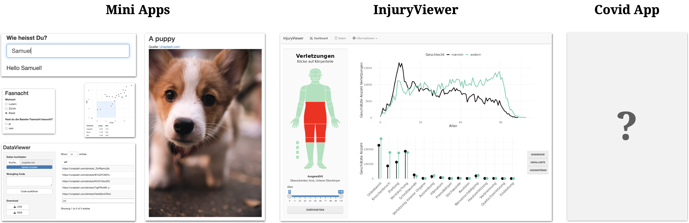

layout: true

<div class="my-footer">
  <span style="text-align:center">
    <span> 
      
    </span>
    <a href="https://therbootcamp.github.io/">
      <span style="padding-left:82px"> 
        <font color="#7E7E7E">
          www.therbootcamp.com
        </font>
      </span>
    </a>
    <a href="https://therbootcamp.github.io/">
      <font color="#7E7E7E">
       Dashboards mit Shiny | März 2023
      </font>
    </a>
    </span>
  </div> 

---


```{r setup, include=FALSE}
options(htmltools.dir.version = FALSE)
options(width=110)
options(digits = 4)

knitr::opts_chunk$set(fig.align = 'center')
```


.pull-left6[

<br><br><br><br><br>

# Ziel

>###Das Ziel dieses Kurses ist Euch den kompetenten Shiny für die Erstellung von Dashboards und Web-Apps und  zu vermitteln. 

]

.pull-right4[

<br><br><br><br>
<p align="center"></p>

]


---

.pull-left35[

# Shiny

<ul>
  <li class="m1"><span><mono>shiny</mono> ist ein R Paket für dynamische Web-Apps und <high>Dashboards</high></span></li><br>
  <li class="m2"><span><mono>shiny</mono> ist auch ein <high>Ökosystem</high> an Support-Paketen</span></li><br>
  <ul class="level">
    <li><span><mono>shinyFeedback</mono></span></li>
    <li><span><mono>shinythemes</mono></span></li>
    <li><span><mono>bslib</mono></span></li>
    <li><span><mono>BT</mono></span></li>
    <li><span><mono>reactlog</mono></span></li>
    <li><span><mono>...</mono></span></li><br>
  </ul>

</ul>

]

.pull-right55[


<p align="center">
<br><br><br>

</p>

]

---

# Kurs Apps

<br>
<p align="center">

</p>

---

<br>
 <iframe src="https://dirkwulff.shinyapps.io/InjuryViewer/" height="540px" width = "1040px" loading = "lazy"></iframe>

---

.pull-left35[

<br>
# Agenda 

<ul>
  <li class="m1"><span>Der <high>Workshop</high> besteht aus mehreren Sessions</span></li><br>
  <li class="m2"><span><high>Session</high></span></li>
  <ul class="level">
    <li><span>Folien-basierte Einführung</span></li>
    <li><span>Viele Übungen</span></li>
    <li><span>Interaktive Zusammenfassung</span></li>
  </ul>
  </span></li>
</ul>

]

.pull-right55[
<br><br>


]

---


# Einführung

.pull-left3[
<br2>

<ul>
  <li class="m1"><span><high>Inhalt</high></span></li>
  <ul class="level">
    <li><span>Konzepte</span></li>
    <li><span>Code Beispiele</span></li>
  </ul><br>
  <li class="m2"><span><high>Dauer</high></span></li>
  <ul class="level">
    <li><span>30-60 min</span></li>
  </ul><br>
</ul>

]

.pull-right6[

<p align="center">
<br>
<font style="font-size:10px">from <a href="https://unsplash.com/photos/MAYsdoYpGuk">Unsplash.com</a></font>
</p>

]

---

.pull-left45[

# Übungen

<ul>
  <li class="m1"><span><high>Inhalt</high></span></li>
  <ul class="level">
    <li><span>Learn-by-doing</span></li>
    <li><span>Steigende Schwierigkeit</span></li>
    <li><span>Lösungen später</span></li>
  </ul><br>
  <li class="m2"><span><high>Zwei Teile</high></span></li>
  <ul class="level">
    <li><span>Mini Apps</span></li>
    <li><span>InjuryViewer</span></li>
  </ul><br>
</ul>

]

.pull-right5[
<br>

 <iframe src="https://therbootcamp.github.io/Shiny_2023CSS/_sessions/ErsteApp/ErsteApp_practical.html" height="480px" width = "500px" loading = "lazy"></iframe>

  Beispiel:<a href="https://therbootcamp.github.io/Shiny_2023CSS/_sessions/ErsteApp/ErsteApp_practical.html"> Erste App </a>

]

---

# Vorstellung

.pull-left5[

<ul>
  <li class="m1"><span>Wie heisst Du?</span></li>
  <li class="m2"><span>Was ist Deine Rolle in der CSS?</span></li>
  <li class="m3"><span>Hast Du Programmiererfahrung mit R oder anderen Programmiersprachen?</span></li>
  <li class="m4"><span>Was motiviert Dich Shiny zu lernen?</span></li>
</ul>

]

.pull-right45[

<p align="center">

<br>
<font style="font-size:10px">from <a href="https://unsplash.com/photos/SymZoeE8quA">unsplash.com</a></font>
</p>

]

---
class: middle, center

<h1><a href=https://therbootcamp.github.io/Shiny_2023CSS/index.html>Agenda</a></h1>
