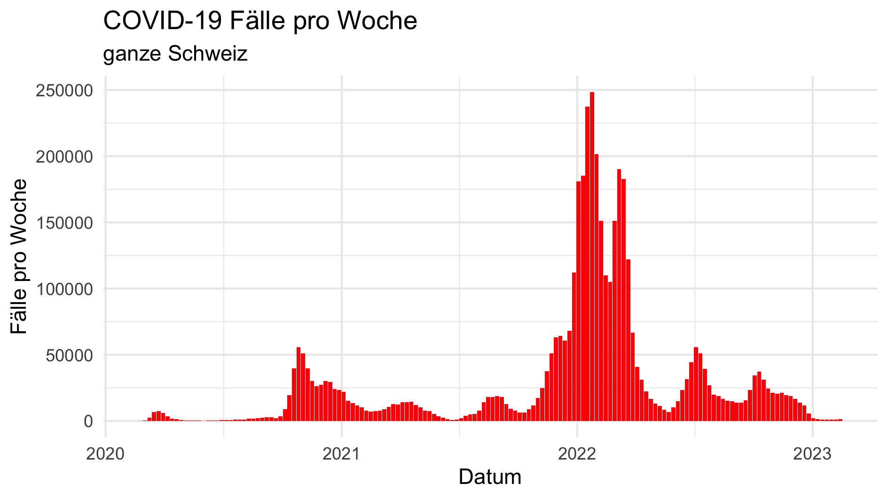
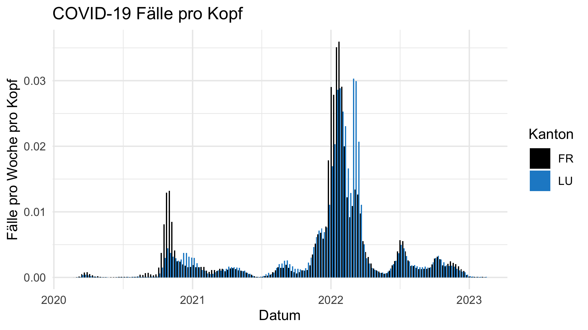
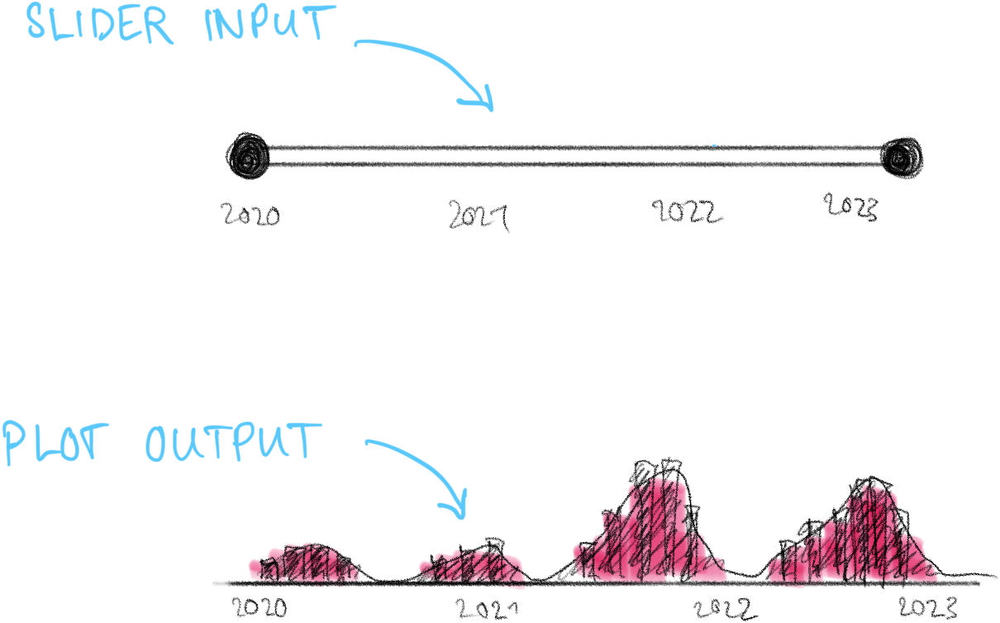
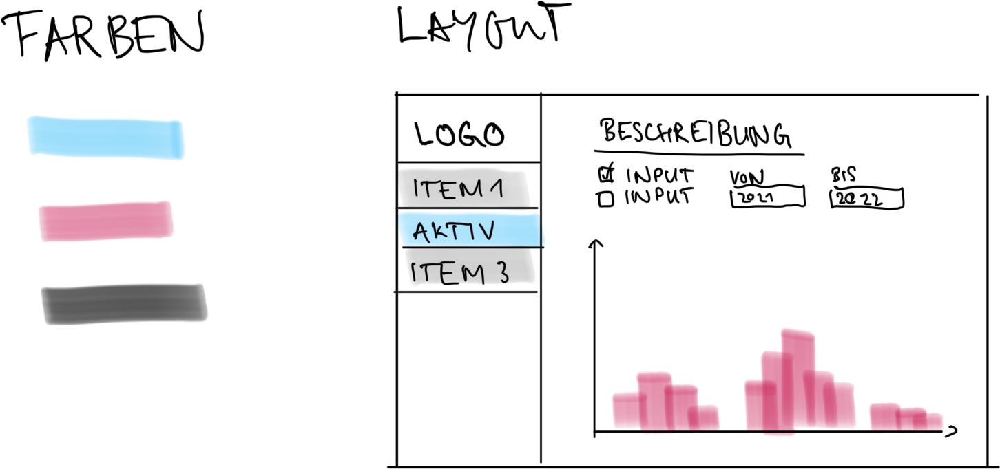

```{r setup, echo = FALSE}
knitr::opts_chunk$set(comment = NA, 
                      fig.width = 6, 
                      fig.height = 6,
                      fig.align = 'center',
                      echo = TRUE, 
                      eval = FALSE, 
                      warning = FALSE,
                      message = FALSE)

options(digits = 3)
```

<p align="center">

<br> <font style="font-size:10px">from [unsplash.com](https://unsplash.com/photos/qwtCeJ5cLYs)</font>

</p>

#  {.tabset}

## Überblick

Zeit eure neuen Skills praktisch anzuwenden. In diesem Teil des Kurses werdet ihr eure Kreativität und Expertise brauchen, um ein COVID-19 Dashboard zu erstellen. Versucht die nützlichsten Interfaces zu erstellen um Usern eures Dashboards die Analyse der Daten zu ermöglichen.

Übrigens, es gibt 🍫🍫🍫 zu gewinnnen.

Der Wettbewerb endet in...

<font style="font-size:32px">

<p id="demo" align="center">

</p>

</font>

```{=html}
<script>
// Set the date we're counting down to
var countDownDate = new Date("Mar 8, 2023 16:40:00").getTime();

// Update the count down every 1 second
var x = setInterval(function() {

  // Get todays date and time
  var now = new Date().getTime();

  // Find the distance between now and the count down date
  var distance = countDownDate - now;

  // Time calculations for days, hours, minutes and seconds
  var days = Math.floor(distance / (1000 * 60 * 60 * 24));
  var hours = Math.floor((distance % (1000 * 60 * 60 * 24)) / (1000 * 60 * 60));
  var minutes = Math.floor((distance % (1000 * 60 * 60)) / (1000 * 60));
  var seconds = Math.floor((distance % (1000 * 60)) / 1000);

  // Display the result in the element with id="demo"
  document.getElementById("demo").innerHTML = days + "d " + hours + "h "
  + minutes + "m " + seconds + "s ";

  // If the count down is finished, write some text 
  if (distance < 0) {
    clearInterval(x);
    document.getElementById("demo").innerHTML = "EXPIRED";
  }
}, 1000);
</script>
```
<br><br><br>

## Auftrag

Zur Vorbereitung auf die nächste Pandemie sucht das Bundesamt für Gesundheit (BAG) nach geeineten Online-Tools, um das Infektionsgeschehen im Blick zu behalten. Nun seid ihr gefragt! Es gibt zwei Datensätze covid-daten.csv und covid-daten-alter.csv, diese stammen vom BAG und enthalten wöchentliche Zahlen zu COVID-19 Infektionen in der Schweiz von Februar 2020 bis Februar 2023. Die Infektionszahlen sind sowohl für die gesamte Schweiz als auch pro Kanton verfügbar. Der Datensatz covid-daten-alter.csv schlüsselt die Infektionszahlen zudem nach Altersgruppen auf, beinhaltet ansonsten die gleichen Daten.

### A - Vorbereitung

1.  Öffne dein `TheRBootcamp` R project. Es sollte die Ordner `1_Data` und `2_Code` enthalten. Stelle sicher, dass du alle Datensätze, welche im `Datensätze` Tab aufgelisted sind, in deinem `1_Data` Ordner hast.

2.  Erstelle eine neue Shiny App. Schreibe deinen Namen, das Datum und "COVID-19 Dashboard" als Kommentare an den Anfang des Skripts.

3.  Speichere das neue Skript unter dem Namen `app.R` im `3_competition` Ordner.

4.  Lade das `shiny` Paket und alle weiteren Pakete, die du verwenden möchtest.

5.  Lade die beiden Datensätze `covid-daten.csv` und `covid-daten-alter.csv`.

```{r, eval = FALSE, echo = TRUE}
## NAME
## DATE
## COVID-19 Dashboard

library(shiny)
library(readr)

covid-daten <- read_csv("covid-daten.csv")
covid-daten-alter <- read_csv("covid-daten-alter.csv")

ui <- fluidPage(
  
)

server <- function(input, output, session) {
  
}

shinyApp(ui, server)
```

### B - Vorgehen

-   Du bist komplett frei, wie du dein Dashboard gestaltest.

-   Wenn du nach Inspirationen suchst, dann schau dir mal die Beispiele im Tab `Beispiele` an.

-   Nutze dein neu erlangtes Wissen aus den Übungen der letzten Tage und versuch es in der Praxis anzuwenden.

### C - Wettbewerbsregeln

1.  Das Ziel des Wettbewerbs ist es die **überzeugenste**, **benutzerfreundlichste** und **schönste** Dashboard-App zu erstellen.

2.  Am Wettbewerb teilzunehmen ermöglicht dir die Chance viel 🍫🍫🍫 zu gewinnen.

3.  Die nimmst am Wettbewerb teil indem du deinen Ordner `3_competition` als `.zip` Datei komprimierst und an uns schickst.

4.  Reiche deine Beitrag ein indem Du deine `.zip` Datei an unsere <a href="mailto:therbootcamp@gmail.com"><b>[therbootcamp\@gmail.com](mailto:therbootcamp@gmail.com){.email}</b></a> Mail Adresse schickst.

5.  Jeder Beitrag wird anonym beurteilt duch eine Jury bestehend aus den Kursteilnehmern. Der Beitrag mit den meisten Punkten gewinnt. Die Beurteilung findet im Anschluss an den Kurs statt.

Wichtig: Entscheidend für den Erfolg sind verschiedene Faktoren: Benutzerfreundlichkeit, Funktionsumfang, Erkenntnisgewinn, Aussehen, usw.

## Rating

Wir informieren euch, wie ihr euer Dashboard an uns schicken könnt und wir machen alle eingereichten Dashboards online verfügbar. Danach könnt ihr abstimmen, welches Dashboard Schokolade gewinnt.

## Beispiele

### Plots

```{r, eval = FALSE, echo = TRUE}

covid-daten %>% 
  filter(region == "CH") %>% 
  ggplot(aes(x = datum, y = anzahl)) +
  geom_col(fill = "#ff0000") +
  labs(title = "COVID-19 Fälle pro Woche", subtitle = "ganze Schweiz") +
  xlab("Datum") +
  ylab("Fälle pro Woche") +
  theme_minimal()

```

{style="width: 75%;"}

```{r, eval = FALSE, echo = TRUE}

covid-daten %>% 
  mutate(pro_kopf = anzahl / population) %>% 
  filter(region %in% c("FR", "LU")) %>% 
  ggplot(aes(x = datum, y = pro_kopf, fill = region)) +
  geom_col(position = "dodge") +
  scale_fill_manual(values = c("FR" = "black", "LU" = "#1e8ccd"), name = "Kanton") +
  labs(title = "COVID-19 Fälle pro Kopf") +
  xlab("Datum") +
  ylab("Fälle pro Woche pro Kopf") +
  theme_minimal()

```

{style="width: 75%;"}

### Interaktivität

{style="width: 75%;"}

### Layouts

{style="width: 75%;"}

## Datensätze

| Datei                     | Zeilen | Spalten |
|---------------------------|--------|---------|
| [covid-daten.csv]()       | 4212   | 5       |
| [covid-daten-alter.csv]() | 42120  | 6       |

##### Variablenbeschreibungen `covid-daten.csv`

| Name         | Bedeutung                                                                                     |
|:---------------------|:-------------------------------------------------|
| `region`     | Region auf die sich die Daten in dieser Zeile beziehen. `CH` oder einer von 26 Kantonen.      |
| `datum`      | Datum, an dem die Woche beginnt, für welche diese Zeile Daten liefert.                        |
| `anzahl`     | Anzahl COVID-19 Fälle, welche in dieser Woche in dieser Region gemeldet wurden.               |
| `summe`      | Anzahl COVID-19 Fälle, welche bis zu dieser Woche in dieser Region insgesamt gemeldet wurden. |
| `population` | Anzahl Personen in dieser Region.                                                             |

##### Variablenbeschreibungen `covid-daten-alter.csv`

| Name           | Bedeutung                                                                                                            |
|:---------------------|:-------------------------------------------------|
| `altersgruppe` | Altersgruppe, auf die sich die Daten in dieser Zeile beziehen.                                                       |
| `region`       | Region auf die sich die Daten in dieser Zeile beziehen. `CH` oder einer von 26 Kantonen.                             |
| `datum`        | Datum, an dem die Woche beginnt, für welche diese Zeile Daten liefert.                                               |
| `anzahl`       | Anzahl COVID-19 Fälle, welche in dieser Woche in dieser Region für diese Altersgruppe gemeldet wurden.               |
| `summe`        | Anzahl COVID-19 Fälle, welche bis zu dieser Woche in dieser Region für diese Altersgruppe insgesamt gemeldet wurden. |
| `population`   | Anzahl Personen in dieser Region und dieser Altersgruppe.                                                            |
