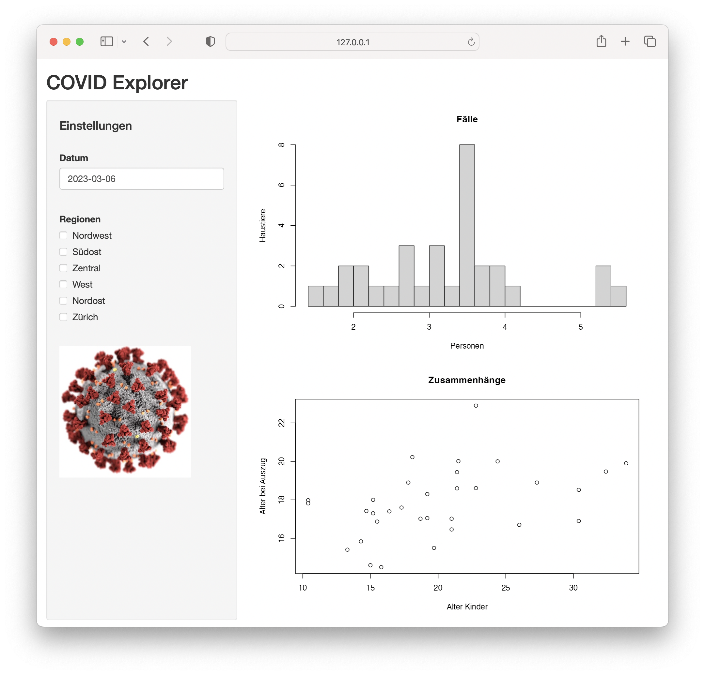
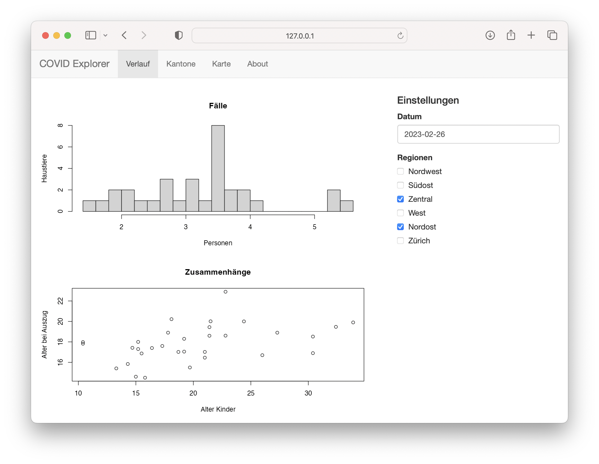

```{r setup, include=FALSE}
knitr::opts_chunk$set(comment = NA, 
                      fig.align = 'center',
                      echo = TRUE, 
                      eval = FALSE, 
                      warning = FALSE,
                      message = FALSE)

options(digits = 3)

library(tidyverse)
covid <- read_csv("data/covid.csv")
```

<p align="center">

<br> <font style="font-size:10px">from [unsplash.com](https://unsplash.com/photos/qwtCeJ5cLYs)</font>

</p>

#  {.tabset}

## Überblick

Zeit eure neuen Skills praktisch anzuwenden. In diesem Teil des Kurses werdet ihr eure Kreativität und Expertise brauchen, um ein COVID-19 Dashboard zu erstellen. Versucht die nützlichsten Interfaces zu erstellen um Usern eures Dashboards die Analyse der Daten zu ermöglichen.

Übrigens, es gibt 🍫🍫🍫 zu gewinnnen.

Der Wettbewerb endet in...

<font style="font-size:32px">

<p id="demo" align="center">

</p>

</font>

```{=html}
<script>
// Set the date we're counting down to
var countDownDate = new Date("Mar 13, 2023 18:00:00").getTime();

// Update the count down every 1 second
var x = setInterval(function() {

  // Get todays date and time
  var now = new Date().getTime();

  // Find the distance between now and the count down date
  var distance = countDownDate - now;

  // Time calculations for days, hours, minutes and seconds
  var days = Math.floor(distance / (1000 * 60 * 60 * 24));
  var hours = Math.floor((distance % (1000 * 60 * 60 * 24)) / (1000 * 60 * 60));
  var minutes = Math.floor((distance % (1000 * 60 * 60)) / (1000 * 60));
  var seconds = Math.floor((distance % (1000 * 60)) / 1000);

  // Display the result in the element with id="demo"
  document.getElementById("demo").innerHTML = days + "d " + hours + "h "
  + minutes + "m " + seconds + "s ";

  // If the count down is finished, write some text 
  if (distance < 0) {
    clearInterval(x);
    document.getElementById("demo").innerHTML = "EXPIRED";
  }
}, 1000);
</script>
```
<br><br><br>

## Auftrag

Zur Vorbereitung auf die nächste Pandemie sucht das Bundesamt für Gesundheit (BAG) nach geeigneten Online-Tools, um das Infektionsgeschehen im Blick zu behalten. Nun seid ihr gefragt! Es gibt einen Datensatz \`covid.csv\`, dieser stammt vom BAG und enthält wöchentliche Zahlen zu COVID-19 Infektionen in der Schweiz von Februar 2020 bis Februar 2023. Die Infektionszahlen sind sowohl für die gesamte Schweiz als auch pro Kanton verfügbar. Der Datensatz schlüsselt die Infektionszahlen zudem nach Altersgruppen auf.

### A - Vorbereitung

1.  Erstelle einen neuen Ordner `competition` in deinem `TheRBootcamp` Projektordner.

2.  Erstelle darin ein neues Skript für deine App und speichere es unter dem Namen `CovidExplorer.R`.

3.  Lade das `shiny` Paket und alle weiteren Pakete, die du verwenden möchtest.

4.  Lade den Datensatz `covid.csv`. Er sollte im `data` Ordner enthalten sein. Im Tab `Datensatz` findest du Informationen zu den Variablen.

```{r, eval = FALSE, echo = TRUE}
library(shiny)
library(readr)

covid <- read_csv("covid.csv")

ui <- fluidPage(
  
)

server <- function(input, output, session) {
  
}

shinyApp(ui, server)
```

### B - Vorgehen

-   Du bist komplett frei, wie du dein Dashboard gestaltest.

-   Wenn du nach Inspirationen suchst, dann schau mal in den Tab `Inspiration`.

-   Nutze dein neu erlangtes Wissen aus den Übungen der letzten Tage und versuch es in der Praxis anzuwenden.

### C - Wettbewerbsregeln

1.  Das Ziel des Wettbewerbs ist es die **überzeugenste**, **benutzerfreundlichste** und **schönste** Dashboard-App zu erstellen.

2.  Am Wettbewerb teilzunehmen ermöglicht dir die Chance viel 🍫🍫🍫 zu gewinnen.

3.  Du nimmst am Wettbewerb teil indem du deinen Ordner `competition` als `.zip` Datei komprimierst und an uns schickst. Lege alle Dateien, die deine App braucht, in diesen `competition` Ordner. Also z.B. alle verwendeten Datensätze, Bilder, R Skripte oder sonstige Dateien.

4.  Reiche deinen Beitrag ein indem Du deine `.zip` Datei an unsere <a href="mailto:therbootcamp@gmail.com"><b>[therbootcamp\@gmail.com](mailto:therbootcamp@gmail.com){.email}</b></a> Mail Adresse schickst.

5.  Jeder Beitrag wird anonym beurteilt duch eine Jury bestehend aus den Kursteilnehmern und Kursteilnehmerinnen. Der Beitrag mit den meisten Punkten gewinnt. Die Beurteilung findet im Anschluss an den Kurs statt.

Wichtig: Entscheidend für den Erfolg sind verschiedene Faktoren: Benutzerfreundlichkeit, Funktionsumfang, Erkenntnisgewinn, Aussehen, usw.

## Rating

Wir machen alle eingereichten Dashboards online verfügbar. Danach bekommt ihr einen Link zu einem Fragebogen in dem ihr abstimmen, welches Dashboard Schokolade gewinnt.

## Inspiration

### Layouts

Überlege dir, welches Layout du für deine App verwenden möchtest. Du könntest z.B. von Hand auf Papier eine Skizze anfertigen und das entsprechende Layout dann in Shiny umsetzen.

Hier sind nochmal ein paar Beispiele für Layouts aus dem Kurs zur Inspiration.

#### Beispiel 1

Das erste Beispiel nutzt das simple aber oft übersichtliche `sidebarLayout` mit `sidebarPanel` und `mainPanel`.

```{r, eval = FALSE, echo = TRUE}

ui <- fluidPage(
  titlePanel("COVID Explorer"),
  sidebarLayout(
    sidebarPanel(
      # hier könnten einige Inputs platziert sein
    ),
    mainPanel(
      # und hier könnten Graphiken platziert sein
    )
  )
)

```



#### Beispiel 2

Das zweite Beispiel verwendet eine navbarPage mit verschiedenen Seiten (tabPanels), darin ein Grid Layout.

```{r, eval = FALSE, echo = TRUE}

ui <- navbarPage(
  "COVID Explorer",
  tabPanel(
    "Verlauf",
    fluidRow(
      column(
        8,
        # hier könnten Graphiken platziert sein
      ),
      column(
        4,
        # und hier Inputs
      )
    )
  ),
  tabPanel("Kantone"),
  tabPanel("Karte"),
  tabPanel("About")
)


```



### Visualisierungen

Versuch dir anhand der Variablen im Datensatz zu überlegen, welche Visualisierungen am informativsten, bzw. interessantesten sind.

Hier ein paar Beispiele für Plots die interessant sein könnten, und die du natürlich auch als Ausgangslage nehmen kannst zum Anpassen.

#### Fälle über die Jahre in der Schweiz

Das erste Beispiel zeigt die wöchentliche Entwicklung der Fallzahlen in der gesamten Schweiz.

```{r, eval = TRUE, echo = FALSE}
library(tidyverse)
covid <- read_csv("data/covid.csv")
kantone <- read_csv("data/kantone.csv")
```

```{r eval = TRUE, echo = TRUE}

covid %>% 
  group_by(region, datum) %>% 
  summarise(anzahl = sum(anzahl), 
            summe = sum(summe), 
            population = sum(population, na.rm = TRUE)) %>% 
  filter(region == "CH") %>% 
  ggplot(aes(x = datum, y = anzahl)) +
  geom_area(fill = "#ff0000", alpha = 0.5) +
  geom_line(color = "#ff0000", linewidth = 1) +
  labs(title = "COVID-19 Fälle pro Woche", subtitle = "ganze Schweiz") +
  xlab("Datum") +
  ylab("Fälle pro Woche") +
  theme_minimal()

```

#### Fallzahlen pro Kanton auf Schweizerkarte

Der nächste Plot zeigt eine Schweizerkarte und kummulierte Fallzahlen pro Kopf je nach Kanton, und zwar für eine bestimmte Woche (hier die erste im Datensatz). Dafür ist ein bisschen R Akrobatik nötig, um die Daten dafür in die richtige Form zu bringen. Du brauchst dafür zudem den Datensatz `kantone.csv`, in dem die Grenzen der Kantone hinterlegt sind für den Plot.

```{r eval = TRUE, echo = TRUE}
covid_first_week <- covid %>% 
  group_by(region, datum) %>% 
  summarise(anzahl = sum(anzahl), 
            summe = sum(summe), 
            population = sum(population, na.rm = TRUE)) %>% 
  mutate(anzahl_pro_kopf = anzahl / population,
         summe_pro_kopf = summe / population) %>% 
  filter(datum == min(datum)) %>% 
  select(region, summe_pro_kopf)

kantone %>%
  left_join(covid_first_week, by = c("kurz" = "region")) %>% 
  ggplot(aes(x = x, y = y, group = kanton_id, fill = summe_pro_kopf)) +
  geom_polygon(col = "grey50") +
  theme_void() +
  theme(legend.position = "none") +
  scale_fill_gradient(low = "white", high = "red")


```

### Interaktivität

Denke darüber nach, welche Elemente du interaktiv gestalten möchtest. Auch dazu hier ein paar Beispiele, die Möglichkeiten sind aber natürlich endlos.

#### Woche auswählen

Du könntest z.B. den Benutzer die Woche auswählen lassen, für welche in einem Kartenplot die Fallzahlen oder kummulierten Fallzahlen angezeigt werden. Dieses Beispiel zeigt einen Slider, der eine Woche auswählen lässt, und ein zugehöriger Plot, der Daten bis zu dieser Woche darstellt.

```{r eval = FALSE, echo = TRUE}
library(shiny)

ui <- fluidPage(
  sliderInput("datum", 
              "Fälle bis zum", 
              min = date("2020-02-24"), 
              max = date("2023-02-13"), 
              value = date("2020-02-24")),
  plotOutput("plot")
)

server <- function(input, output, session) {

  output$plot <- renderPlot({
    covid %>% 
      group_by(region, datum) %>% 
      summarise(anzahl = sum(anzahl), 
                summe = sum(summe), 
                population = sum(population, na.rm = TRUE)) %>% 
      filter(region == "CH") %>% 
      filter(datum <= input$datum) %>% 
      ggplot(aes(x = datum, y = anzahl)) +
      geom_area()
  })

}

shinyApp(ui, server)
```

#### Kantone auswählen

Eine weitere Dimension, die interaktiv verändert werden könnte, ist, für welche Region sich ein User Daten anschauen möchte. Mittels `slectInput` lassen sie sich einfach auswählen. Zudem ist in diesem Beispiel ein Button definiert, der die Auswahl zurücksetzt.

```{r eval = FALSE, echo = TRUE}

library(shiny)

ui <- fluidPage(
  selectInput("regionen", "Regionen", 
              choices = c("AG", "AI", "AR", "BE", "BL", "BS", 
                          "FR", "GE", "GL", "GR", "JU", "LU",
                          "NE", "NW", "OW", "SG", "SH", "SO",
                          "SZ", "TG", "TI", "UR", "VD", "VS",
                          "ZG", "ZH", "CH"),
              multiple = TRUE),
  actionButton("region_zurücksetzen", "Regionen zurücksetzen", 
               icon = icon("times"))
)

server <- function(input, output, session) {
  observeEvent(input$region_zurücksetzen, {
    updateSelectInput(inputId = "regionen", selected = character(0))
  })
}

shinyApp(ui, server)

```

#### The sky is the limit...

Dies waren nur ein paar Beispiele um eure Covid Explorer Entwicklung zu inspirieren, setzt eure eigenen Ideen um, oder passt die Beispiele an um sie besser zu machen.

## Datensätze

### covid.csv

| Name           | Bedeutung                                                                                                            |
|:------------------------|:---------------------------------------------|
| `altersgruppe` | Altersgruppe, auf die sich die Daten in dieser Zeile beziehen.                                                       |
| `region`       | Region auf die sich die Daten in dieser Zeile beziehen. `CH` oder einer von 26 Kantonen.                             |
| `datum`        | Datum, an dem die Woche beginnt, für welche diese Zeile Daten liefert.                                               |
| `anzahl`       | Anzahl COVID-19 Fälle, welche in dieser Woche in dieser Region für diese Altersgruppe gemeldet wurden.               |
| `summe`        | Anzahl COVID-19 Fälle, welche bis zu dieser Woche in dieser Region für diese Altersgruppe insgesamt gemeldet wurden. |
| `population`   | Anzahl Personen in dieser Region und dieser Altersgruppe.                                                            |

### kantone.csv

| Name        | Bedeutung                                                         |
|---------------|---------------------------------------------------------|
| `kanton`    | Kantonsname                                                       |
| `kanton_id` | Kantons-id (mehrere pro Kanton, da manche Kantone "Inseln" haben) |
| `x`         | x-Koordinate                                                      |
| `y`         | y-Koordinate                                                      |
| `kurz`      | Kantonskürzel (z.B. ZH, AG, LU, usw.)                             |
